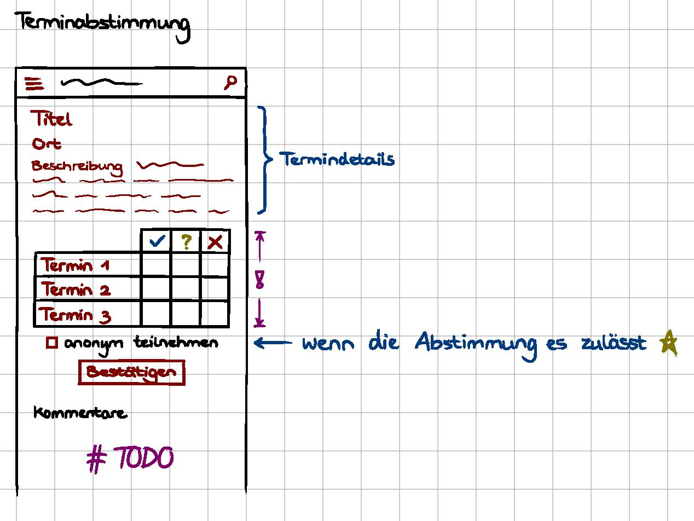

= Dokumentation zum Projekt "Terminfindung & Umfragen"

== Tag 1

Der erste Tag des Projektes begann mit einer Einführung für alle im Hörsaal und bestand insgesamt darin, die ersten Ideen für das System zu Terminfindungen & Umfragen zu generieren.
Dazu sollten wir ein Werbeplakat gestalten, das die Hauptideen des Projektes beinhalten sollte und einen Bogen ausfüllen, der uns geholfen hat, unsere Ideen und gegebenenfalls vorhandene Fragestellungen zu strukturieren.

== Tag 2

Als Basis des Projektes war die erste Aufgabe, die Geräte richtig zu konfigurieren.
Dazu zählte die Installation von Checkstyle, SpotBugs etc.
Weiter wurde in GitHub die Branch Protection und GitHub Actions aktiviert, was von Leon erledigt wurde.
Anschließend daran wurde das Projekt mit SpringBoot als Gradle Projekt initialisiert.
Diesen Teil haben Jan und Thomas übernommen.
Der nächste Schritt war nun das Einbinden des Styleguides, welches Julia und Kathi erledigt haben.
Danach hat Anton die erste Indexseite erstellt.
Dort trat das erste Problem mit dem Logging Fenster auf, denn es war noch keine Security eingerichtet.
Aus diesem Grunde wurde diese vorübergehend (in build.gradle) auskommentiert.
Zeitgleich hat sich Marcel daran versucht, die docker-compose-Datei und das Dockerfile zu schreiben, welches in den Anforderungen gefragt war.
Da es noch Unstimmigkeiten mit der Wahl der Datenbank gab, wurden diese Dateien noch nicht hochgeladen.
Zudem wurden von Ingrid erste Konzepte für das Webdesign entwickelt.

image::concept.jpg[]

Zum Abschluss des Tages haben wir uns über die verschiedenen Aufgaben ausgetauscht und die Erfolge bzw.
Probleme zusammengetragen.
Anschließend erfolgte noch ein kurzes Brainstorming über die anstehenden Aufgaben des nächsten Tages.
Da dies sehr gut geklappt hat und einen guten Überblick über die absolvierten und anstehenden Aufgaben geliefert hat, haben wir beschlossen, dies ab jetzt jeden Tag durchzuführen.

== Tag 3

Die erste Aufgabe des Tages war eine gemeinsame erste Erarbeitung des Arc42 Templates.
Anschließend haben wir noch einmal kurz die Aufgaben für den Tag auf kleine Gruppen von 2-3 Personen aufgeteilt.

=== Checkstyle (Kathi, Leon)
Leon hatte bereits eine grundlegende Konfigurationsdatei für Checkstyle vorbereitet.
Über den Tag sind wir durch die Dokumentation von Checkstyle gegangen und haben für die einzelnen Module entschieden, welche für unser Projekt Sinn machen.
Am Ende des Tages sind ein paar Probleme aufgetreten, hauptsächlich bei dem Modul "Indentation", da dieses mit Tabs anders arbeitet als mit Leerzeichen.
Wir haben uns entschieden am nächsten Tag zu diskutieren, wie wir damit weiter vorgehen sollen.

=== Datenbankmodell (Julia, Thomas, Marcel)
Unser erster Ansatz für das Datenbankmodell war die Erstellung des ER-Modells.
Anschließend erfolgte eine erste Datenbankmodellierung mit MySQL Workbench.
Nach dem ersten Upload des ER-Modells auf GitHub wurden wir von den Tutoren auf eine ungünstige Beziehung hingewiesen.
Dies ist uns vorher nicht aufgefallen und wurde auch beim Datenbankschema umgesetzt.
Daraufhin haben wir über eine alternative Modellierung nachgedacht und die Änderungen aus Zeitmangel auf den nächsten Tag verschoben.

=== Web-Userinterface (Ingrid, Anton, Jan)
Da die Views einen uniformen visuellen Stil haben müssen, haben wir diese (6 Stück) so aufgeteilt, dass eine Person die Übesichtsviews, eine Person die Detailviews und eine Person die Formularviews übernimmt.
Wir haben angefangen die Sichten zu bauen, obwohl die Datenbank noch nicht fertig ist, weil wir schon abgesprochen haben welche Daten die Datenbank vom Interface bekommen soll und welche Inputfelder darin enthalten sein sollten.
Außerdem wurde ein Konzept für Terminabstimmungen entwickelt.

=== Klassen (Thomas, Jan)
Nachdem das Datenbankenteam auf die Problematik der Beziehung hingewiesen wurde und Jens uns den Tipp gab lieber mit der Geschäftslogik anzufangen, begannen wir uns zu überlegen welche Klassen benötigt werden, um das gewünschte Verhalten zu ermöglichen.
Wir orientierten uns dabei aber noch immer zu sehr am Datenbankmodell.

== Tag 4

Die Aufgaben vom Vortag wurden größtenteils in den Gruppen fortgesetzt.

=== Checkstyle (Kathi, Leon)
Heute haben wir ein paar Kleinigkeiten an der Checkstyle Konfigurationsdatei geändert.
Unter anderem, dass eine Zeile bis zu 120 Zeichen enthalten darf und nur .java Dateien überprüft werden sollen.
Die Module "MagicNumbers" und "MultipleStringLiterals" wurden auch rausgenommen, da dies für uns zu streng war.
Das Modul "AvoidDoubleBraceInitialization" hat zu Problemen mit dem eclipse Checkstyle Plugin geführt, weswegen auch dieses rausgenommen wurde.
Außerdem wurden Module hinzugefügt, die die Namen von Variablen, Methoden etc. überprüfen.
Als wir damit fertig waren, haben wir eclipse und IntelliJ so eingestellt, dass die automatische Formatierung der IDE zu keinen Fehlern mit Checkstyle führt und die entstandenden Dateien an die anderen Mitglieder des Teams verteilt, sodass der Umsprung auf das neue Format ohne Probleme erfolgen kann.

=== Datenbankmodell/Klassen (Julia, Thomas, Marcel)
Die Aufgabe des Tages war, das Datenbankmodell erneut zu diskutieren, da das alte Modell verworfen wurde.
Die Idee ist nun, von der Geschäftslogik ausgehend die Struktur zu modellieren, und sich danach Gedanken über das konkrete Datenbankmodell zu machen.

=== Web-Userinterface (Ingrid, Anton, Jan)
An diesem Tag wurde an der Terminübersicht gearbeitet (unter anderem daran, dass die Frist erkennbar ist).
Es wurde insgesamt an der UI gearbeitet (u.a. an Buttons), und an der Abstimmung zu Umfragen.

Zusätzlich dazu haben Marcel und Julia die Dokumentation für Tag 1-3 zusammengestellt und die Art und Weise geplant, wie die Dokumentation fortlaufend erweitert wird.
Außerdem haben Thomas und Jan die ersten Entitäten mithilfe von Spring Data JPA erstellt (und annotiert), sodass demnächst die Datenbank dazu modelliert werden kann.

== Tag 5

=== Config (Leon, Jan)
An diesem Tag wurde Checkstyle korrigiert, und an den Stellen im Team ausgeholfen, wo Hilfe benötigt wurde. Außerdem
wurden Reviews zu verschiedenen pull requests gemacht. Zuletzt wurde GitHub Actions so überarbeitet, dass
gradle check bei einem Push auf GitHub automatisch ausgeführt wird.

=== Datenbankmodell/ Klassen (Julia, Kathi, Thomas, Marcel)
Heute haben wir uns überlegt, wie man die Modell-Klassen anhand der Geschäftslogik am besten modellieren kann.
Anschließend wurden diese erstellt.
Zudem wurden die Entities und Repositories geschrieben.
Zum Schluss haben wir über erste Testansätze gesprochen und entschlossen, am nächsten Praktikumstag einen Database-Initializer zu schreiben, der Fake-Daten generiert.

=== Web-Userinterface (Ingrid, Anton, Jan)
Heute wurde an der UI gearbeitet und das Design für später entworfen, sodass wir insgesamt ein uniformes Aussehen
erreichen können. Es wurden zudem Fehler aus den HTML-Dateien entfernt und diese für Thymeleaf bereit gemacht.
Nun sind außerdem die Ergebnisse in den Umfragelisten einsehbar. Weiter wurde weitere Recherche zur Weiterarbeit
betrieben, und diverse Formatänderungen unternommen.

== Tag 6

=== (Anton)
Heute wurde die Arbeit mit Thymeleaf begonnen, die Controller mit "SessionScope" annotiert und die README überschrieben,
sodass diese u.a. eine Management Summary des Projektes enthält. Außerdem wurde weiter an der UI für die
Erstellung einer neuen Terminfindung gearbeitet.

=== (Thomas, Anton)
Es wurden die application.properties mit H2 für das Development vorbereitet.

=== (Thomas, Leon)
Heute wurde weiter an der Datenbank und an den Keycloak-Konfigurationen gearbeitet. Außerdem wurde sich
mit den Rollen bei den Controllern auseinandergesetzt. Zudem wurden Tests begonnen, die momentan noch
zu Problemen führen.

Nachdem Keycloak soweit in das Projekt eingebunden war, hat sich Leon zu Thomas gesellt, sodass sie sich
gemeinsam an den noch fehlschlagenden Tests versuchen konnten. Dies lag daran, dass die Tests nur auf die Webseite zugreifen wollten und sich nicht einloggen konnten.
Die Versuche, die fehlschlagenden Tests mit @WithMockUser zu beheben, haben noch nicht funktioniert, weswegen sich beide diese Aufgabe für den nächsten Tag vorgenommen haben.

=== Datenbankmodell/ Klassen/ erste Services (Kathi, Julia, Jan, Marcel, Leon)
Zunächst wurden sich grundlegende Gedanken zu dem Database Initializer gemacht, der am Folgetag implementiert werden sollte.
Zudem wurden noch kleine Fehlernin den Modell-Klassen korrigiert, wie 'Date' zu 'LocalDateTime' geändert.
Insgesamt wurde die Entwicklung des Datenbankmodells mit einer Review dieses Modells abgeschlossen.
Außerdem wurden erste Ideen zu einem TerminfindungsService gesammelt, sowie erste Strukturen dafür entworfen.

=== UI (Ingrid)
Heute wurden hauptsächlich pull requests bearbeitet und die daraus resultierenden merge-Konflikte behoben.
Zudem wurde weiter an den HTML-Dateien gearbeitet.

== Tag 7

=== TerminfindungService (Anton, Jan, Marcel)
Die ersten Methoden für die Klasse TerminfindungService wurden geschrieben.
Parallel zu den Methoden haben wir Tests geschrieben, um die Funktionalität zu prüfen.
Da für zwei der Methoden im TerminfindungService Queries benötigt wurden, haben wir diese in der Klasse TerminfindungRepository explizit annotiert.

=== Keycloak (Thomas, Leon)
Die zuerst verwendeten Annotationen in der Controller Test-Klasse haben mit Keycloak nicht funktioniert.
Diese wurden dann abgeändert und durch @SpringBootTest erweitert.
Außerdem wurde die Methode um ein Account-Objekt zu erstellen abgeändert, da bei den Test kein KeycloakToken, sondern ein Principal übergeben wurde und dieses die E-Mail-Adresse eines Benutzers nicht beinhaltet.
Leon hat die Fremdschlüsselbeziehungen in der Datenbank durch Hinzufügen eines Dialektes in der application.properties hinzugefügt.

=== DB-Initializer (Kathi, Julia)
Heute wurde damit begonnen, den Database Initializer zu schreiben, der zum Start der Anwendung die Datenbank mit ersten Fake-Daten füllt.
Insgesamt wurde die Tabelle "BenutzerGruppeDB" mit Daten gefüllt und Methoden geschrieben, die eine Erstellung einer Terminfindung bzw. einer Umfrage eines Benutzers für eine seiner Gruppen simuliert und die Daten speichert.

=== UI (Ingrid)
An diesem Tag wurde an den Views weitergearbeitet.

== Tag 8

=== TerminfindungService und UmfrageService (Leon, Marcel, Jan)
Die Tests für TerminfindungService wurden weiter bearbeitet und verbessert.
Währenddessen haben Leon und Marcel die ersten Methoden zum UmfrageService geschrieben.
Parallel dazu wurden auch hier Tests zur Funktionalität des Services geschrieben.
Die Orientierung lag hierbei am bereits vorhandenen TerminfindungService (bzw. den Tests dazu).

=== Thymeleaf (Thomas, Anton)
In der Übersicht für Terminfindungen wurden Thymeleaf-Attribute hinzugefügt.
Zusätzlich wurden im zugehörigen Controller Testdaten eingefügt, die dann auf der Webseite angezeigt werden können.

=== DB-Initializer (Kathi, Julia)
Zu dem Database-Initializer wurden nun die vorgegebenen Accounts von Keycloak hinzugefügt (studentinX und orgaX).
Zudem gewann der Database-Initializer an Methoden: Nun wurde ermöglicht, Terminfindungen bzw.
Umfragen für alle Nutzer (nicht auf eine Gruppe beschränkt) zu erstellen und die Antworten wurden für Gruppen-Terminfindungen bzw.
-Umfragen gespeichert.

=== UI (Ingrid)
Es wurde an Views weitergearbeitet, einiges am Design verändert und insgesamt die Funktionalität verbessert.

== Tag 9

=== TerminfindungService (Jan)
Die von Thomas angemerkten Probleme wurden behoben, indem loadByErstellerOhneTermine und loadByGruppe ohne Termine erstellt bzw. abgeändert wurden.
Die Daten werden im Service gefiltert, nachdem eigentlich versucht wurde, sich die Objekte direkt aus der Datenbank zu holen, um so das eigene Filtern zu verhindern.
Den Service und die Tests wurden überarbeitet, sodass wesentlich weniger Datenbankaufrufe notwendig sind.

=== DB (Thomas, Jan)
Es ist aufgefallen, dass beim Laden der Terminfindungen die Daten mehrfach vorhanden sind und zu viele Datenbankaufrufe gemacht werden. Das liegt an der vorhandenen Redunzanz in der Datenbank.
Diese Probleme wurden von Leon und Marcel behoben.
Währenddessen wurde ein Service für die Termin-Übersicht geschrieben, welcher die vorhandenen Termine für einen Benutzer lädt und diese dem Controller der Übersicht - aufgeteilt in bereits abgeschlossene und noch offene Terminabstimmungen - bereitstellt. Zusätzlich wurde ein Service geschrieben, der alle Gruppen für einen Benutzer bereitstellt.

=== UmfrageService (Leon, Marcel)
Die von Thomas angemerkten Fehler, dass beim Laden die Daten mehrfach angezeigt werden, wurden behoben, indem die beiden Methoden loadByErsteller und loadByGruppe überarbeitet wurden.
Hierbei erfolgt nun eine Filterung der Daten im Service.
Anschließend wurden auch die Tests nochmal überarbeitet und ergänzt.

=== DB-Initializer (Kathi, Julia)
Heute wurde der DB-Initializer um Methoden zur Befüllung aller restlichen Datenbanktabellen erweitert.
Kleinere letzte Änderungen aufgrund einer Review wurden aus Zeitgründen auf den nächsten Tag verschoben.
Zudem haben wir den LinkService angefangen, der eine gültige Link-ID generiert oder eine übergebene Link-ID des Benutzers auf Gültigkeit prüft.
Die Tests sollen am nächsten Tag geschrieben werden.

=== UI (Ingrid, Anton)
Wir haben an der Verbesserung der Oberfläche gearbeitet und die Umfragen-Übersicht hat die erste Hälfte an Thymeleaf bekommen, so dass Dummy-Daten aus dem Controller korrekt ausgelesen und angezeigt werden.

== Tag 10

=== TerminAntwortService (Jan, Marcel)
Es wurde am TerminAntwortService gearbeitet. Dieser ist dafür zuständig, die Antworten eines Benutzers bezüglich einer bestimmten Terminumfrage zu speichern und zu laden. Ebenso soll der Service alle Antworten laden können, um das Auswerten eines Ergebnisses zu ermöglichen.
Dabei eröffnet sich die Frage, ob die Klasse für das Berechnen des Ergebnisses zuständig sein sollte oder wirklich nur für das Speichern und Laden der Antworten.
Wegen des Single Responsibility Prinzips wird das Berechnen des Ergebnisses in einer anderen Methode erfolgen.

=== UI (Anton, Ingrid)
Es wurden die Thymeleaf-Attribute für die Übersicht der Umfragen fertiggestellt und angefangen, die Datenbank einzubinden .
Die Terminfindung- und Umfragenabstimmung sind visuell fertig und brauchen jetzt Thymeleaf. Zudem wurden die
Views für die Terminfindung weiterentwickelt.

=== DB-Initializer/ LinkService (Kathi, Julia)
Der DB-Initializer wurde nun angepasst und fertiggestellt.
Außerdem wurden heute Tests für den LinkService geschrieben.
Als letztes haben wir uns erste Gedanken darüber gemacht, wie man den LinkService sinnvoll integrieren kann, um bei Erstellung einer neuen Terminfindung/ Umfrage den Link zu prüfen.

=== Urlaub (Thomas)
-

== Tag 11

=== Abstimmungsfunktion (Termine) (Jan)
Ziel war es, den Controller für die View termine-abstimmen anzulegen und dabei die Abstimmungsfunktion zu implementieren.
Jedoch musste noch auf einige PullRequests gewartet werden, weshalb zunächst Ablaufpläne erstellt wurden:

=====  Get(termine-abstimmung)

image::ourimages/tag11/flussDiaGetAbstimmung.jpg[]

Eine Schwierigkeit, bei der über die Änderung einiger Methoden aus dem TermineAntwortService nachgedacht werden könnte, ist,
wie die Antwort geladen wird. Was, wenn sich seit dem letzten Antworten eines Nutzers die Umfrage geändert hat? (Dabei will ich außer Acht lassen, dass höchstens Termine hinzugefügt werden können, um den Code möglichst allgemein zu halten.)
Es wäre eine Möglichkeit, die geladene Antwort-Klasse mit allen Antwortmöglichkeiten aufzufüllen und dann die Antworten für die jeweiligen Möglichkeiten zu laden.

===== Post(termine-abstimmung)

image::ourimages/tag11/flussDiaPostAbstimmung.jpg[]

Eine Schwierigkeit wird es sein, festzuhalten, zu welchem Termin eine Antwort gehört.
Eine Lösung wäre es, die Reihenfolge zu beachten, in der die TerminOptionen und Antworten stehen.
Es sollte dann aber überprüft werden ob sich die Umfrage seit dem letzten Aufruf geändert hat. (Evtl mit einer Map) (Es eröffnet sich eine weitere Schwierigkeit:
Bisher wird überprüft, ob ein Student an einer Umfrage teilgenommen hat, indem überprüft wird, ob Antworten von ihm in der Tabelle stehen.
Wenn die Abstimmungsoptionen aber verändert wurden, ergibt es durchaus Sinn, ihm nochmal in der Übersicht anzuzeigen, dass er abstimmen sollte, ohne seine alten Antworten zu löschen (wenn z.B eine Option hinzugekommt oder gelöscht wurde).)

=== Terminfindung Übersicht, Auslagerung (Thomas)
Der Service für die Termin-Übersicht wurde vorerst fertiggestellt. Die bereits abgeschlossenen Termine werden bisher noch nicht korrekt sortiert, was später verbessert wird.
Außerdem wurden der vorhandene Controller in jeweils einen Controller für jede html-Seite aufgeteilt um das parallele Arbeiten und die Übersicht zu vereinfachen. Zusätzlich wurde das Erstellen der Account Objekte in einen eigenen Service ausgelagert, da dieser in jedem Controller benötigt wird.

=== (Anton)
Eigene Icons für die Sidebar wurden erstellt und in HTML eingebunden. Außerdem wurde Checkstyle angepasst, damit Bilder ignoriert werden.
Zusätzlich wurde am Kommentarservice mitgearbeitet und für TempusDominus recherchiert.

=== KommentarService (Kathi, Julia, Anton)
Wir haben die Klasse Kommentar zu den Model-Klassen hinzugefügt und einen KommentarService geschrieben.

=== LinkService/ KommentarService (Julia, Kathi)
Der LinkService wurde korrigiert und in den Master gemerged. Wir haben Tests zum KommentarService hinzugefügt
und im KommentarService wurde die delete Methode geändert.

=== UmfrageAntwortService (Marcel)
Der UmfrageAntwortService wurde erstellt und analog zum TerminAntwortService wurden die benötigten Methoden geschrieben. Passend dazu wurden auch Tests hinzugefügt, um die jeweiligen Methoden zu testen. Eventuell bleiben noch Änderungen offen. Dies ergibt sich aus weiteren Erfahrungen mit anderen Teilen des Projektes. 

== Tag 12

=== Implementierung der Antwort-Funktion (Termine) (Jan)
Es wurde mit der Umsetzung der Pläne des Vortages bezüglich der Logik, der das Abstimmen unterliegt, begonnen und
einiges in den Services geändert, um Code wiederverwertbar zu machen und die Methoden einfach zu halten.
Außerdem wurde Thymeleaf in der Abstimmungsseite hinzugefügt. Es muss nun noch Debugged werden.

=== UI (Ingrid, Anton, Thomas)
Es wurden die Views für Formulare fertiggestellt (neuer Termin/ neue Bestellung), Thymeleaf für
die Umfragenübersicht hinzugefügt und die notwendigen Controller (u.a. für neue Termine) und Services geschrieben.

=== DB-Initializer/ KommentarService (Julia, Kathi)
Nach Wünschen der anderen Teammitglieder haben wir den DB-Initializer so erweitert, dass für
studentin1, studentin2 und studentin3 immer eine Terminumfrage und eine Umfrage erstellt wrid.
Für die Methode loadByLink im KommentarService haben wir Tests hinzugefügt. Aufgrund eines fehlschlagenden
Tests haben wir Fehler im KommentarService entdeckt und korrigiert.

=== UmfrageService (Leon, Marcel)
Ein Fehler im Test wurde behoben und anschließend war die Bearbeitung dieser Klasse fertiggestellt.

=== GruppeController (Leon, Marcel)
Es wurden erste Überlegungen mit der Schnittstelle zum Projekt "Gruppenbildung" gemacht. Dazu wurden die Api und die angegebenen get-Anfragen sowie deren Rückgabe analysiert. Hier waren einige Fragen offen, welche durch die Tutoren beantwortet werden konnten. Eine Frage war beispielsweise, woher wir die groupIds bekommen, die für getGroup benötigt werden. Diese hat sich dadurch geklärt, dass die Anfrage updateGroups bereits alle nötigen Informationen (alle Gruppen mit Inhalt, die bis zur angegebenen Statusnummer geändert wurden) liefert. Dies hat in sofern geholfen, da uns vorher nicht klar war, welche Bedeutung die Statusnummer hat.

== Tag 13

=== (Ingrid, Anton, Thomas)
Beim Erstellen neuer Terminfindungen können jetzt einzelne Terminvorschläge hinzugefügt und entfernt werden.
Die Funktionalität nach Gruppen zu filtern wurde in der Terminübersicht hinzugefügt. Hierzu werden alle Gruppen eines Benutzers in einem Dropdown Menü angezeigt.
Es wurden redirects zu Details hinzugefügt, Controller für neue Termine fertiggestellt, und der Button
für die Gruppenauswahl auf der Übersichtsseite zeigt nun die richtige Gruppe an.

=== Implementierung der Antwort-Funktion und des Ergebnisses (Jan)
Beim Debugging mussten einige NullPointer Exceptions gelöst werden, weshalb einige Services
angepasst und ein wenig refactored wurden. Das Löschen von Einträgen über die Query
"deleteAllByTerminfindungLinkAndBenutzer" funktionierte nicht. Die Lösung dafür war, die zu
löschenden Objekte zuerst zu laden und erst dann mit delete(Objekte) zu löschen. Zudem gab es einige Fehler,
die wohl auftraten, da die Datenbank noch ein veraltetes Schema hatte; docker-compose down -> docker-compose up löste das Problem.
Anschließend wurde weiter geplant, wie das Ergebnis angezeigt werden sollte. Als alle Probleme gelöst wurden, ging es ans Refactoring.
Dabei wurde auch nachgedacht, wie das Ergebnis angezeigt werden könnte, und es wurden die Grundlagen für die Implementierung geschaffen.

=== GruppeScheduler (Leon, Marcel)
Zum Testen der Schnittstelle zur Gruppe "Gruppenbildung" haben wir uns überlegt, ein Programm zu schreiben, welches Antworten für die nötige Anfrage liefert. Dabei gab es zunächst ein paar Probleme, die JSON-Objekte richtig zurückzugeben. Die Lösung des Problems war anschließend, ein ResponseEntity zu verwenden, da vorher lediglich ein reiner String verwendet wurde. Bevor wir mit dem GruppeScheduler begonnen haben, klärten wir einige Fragen mit den Tutoren. Unter anderem haben wir geklärt, welche Informationen uns die API der Gruppenbildung liefert und welche Anfragen für uns relevant sind. Im Anschluss haben wir die ersten Ansätze umgesetzt und mit unserem Testprogramm zwischenzeitlich getestet. Dabei gab es noch den Fehler, dass die Scheduled-Methode nicht ausgeführt wird. Dieser Fehler lag darin, dass wir noch die Annotation @RequestMapping("/termine2") verwendet haben. Am Ende gab es noch eine NullPointerException beim Speichern der Objekte. Für dieses Problem reichte allerdings die Zeit nicht mehr und es wurde auf den nächsten Tag verschoben.

=== Fehlerbehebung und Import (Kathi, Julia)
Zunächst haben wir Jan den Großteil des Tages beim Debugging und bei der Fehlersuche geholfen. Anschließend
haben wir uns Gedanken über den Import von Terminen in einer CSV-Datei bei der Erstellung einer neuen Terminfindung gemacht.
Dazu haben wir die Möglichkeiten dafür recherchiert und erste Pläne aufgestellt.

== Tag 14 

=== Implementierung der Antwort-Funktion und des Ergebnisses oder auch TerminAbstimmungsDetails (Jan)
Bei dem Refactoring und dem Anzeigen des Ergebnisses ist einiges an Logik 
hinzugekommen, was wieder in Form von Flussdiagrammen versucht wurde festzuhalten.
Da das Abstimmen bei den Umfragen ähnlich ablaufen wird, wurden einige Kommentare
hinzugefügt, die anlässlich der Implementierung des Abstimmens für Umfragen Beachtung
finden könnten.

==== Details
Wenn termine2/link aufgerufen wird, wird entschieden, ob die Abstimmung oder Ergebnisseite angezeigt wird:

image::ourimages/tag14/get-details.jpg[]
Kommentar : Es könnte Logik eingefügt werden, um sicherzustellen, dass das Ergebnis erst nach der Frist angezeigt wird.
(abhängig von der Abstimmung (interessant für die Umfrage))

==== Abstimmungs-Übersicht
Wenn termine2/link/abstimmung aufgerufen wird, gelangt man auf die Abstimmungs-Seite der Umfrage "link"-
Auf der Seite werden die Informationen zur Terminfindung angezeigt und 
es besteht die Möglichkeit, über die Termine abzustimmen und über einen Post abzustimmen. Danach wird man auf die Ergebnis-Seite umgeleitet.

image::ourimages/tag14/get-termine-abstimmung.jpg[]
Kommentar: Hier könnte noch Logik eingefügt werden, um den Nutzer darüber zu informieren, wie viele Stimmen er hat.

==== Post Abstimmen

image::ourimages/tag14/post-termine-abstimmung.jpg[]
Kommentar: Hier könnte noch Logik eingefügt werden, um
sicherzustellen, dass ein Nutzer nur eine feste Anzahl 
an Stimmen hat, die er abgibt ,und wenn er die Regel nicht
erfüllt. Des Weiteren könnte Logik von Nöten sein,
die zum Beispiel prüft, ob der Nutzer bereits abgestimmt
hat, um Änderungen der Abstimmung zu vermeiden
(abhängig vom Abstimmungsmodus (eher für Umfrage interessant)).

==== get-Ergebnis
Das (Zwischen-) Ergebnis wird angezeigt, wenn der Link termine2/link/ergebnis aufgerufen wird und wenn man zumindest schon einmal abgestimmt hat.
(Ansonsten redirect zur Abstimmung) Es ist ein Button dort, der auf die Abstimmung verweist, um seine Wahl zu ändern.

image::ourimages/tag14/get-termine-ergebnis.jpg[]
Kommentar:
Der Button müsste bei Umfragen evtl. entfernt werden 
(abhängig von der Umfrage).
Es könnte Logik eingefügt werden, um sicherzustellen,
dass das Ergebnis erst nach der Frist angezeigt wird
oder erst wenn jemand abgestimmt hat
(abhängig von der Abstimmung (interessant für die
Umfrage)).

=== Terminübersicht (Thomas)
In der Terminübersicht werden jetzt alle relevanten Termine für einen Benutzer angezeigt - inklusive der Termine, die nur über einen Link erreichbar sind, an denen der Benutzer aber bereits teilgenommen hat. Die abgeschlossenen Termine (Termine, bei denen die Frist bereits abgelaufen ist) werden nach dem Ergebnis der Abstimmung sortiert. Dabei werden die als nächstes anstehenden Termine oben angezeigt und die, die bereits in der Vergangenheit liegen, ganz unten.

=== Neue Umfrage (Anton)
Es wurden GetMapping und PostMappings geschrieben, damit man im Formular neue Umfragen-Vorschläge hinzufügen kann.
Dafür wurde die entsprechende HTML Seite um nötige Thymeleaf Attribute erweitert.

=== GruppeScheduler (Leon, Marcel)
Erstes Thema war die Problembehebung der NullPointerException. Dieses haben wir während der Videokonferenz in Jitsi behoben, indem wir an das Repository die Annotation @Autowired geschrieben haben. Nachdem dies nun funktioniert, haben wir als nächstes die Implementierung des Löschens einer Gruppe vorgenommen. Dies geschieht, wenn beim Request an die API der Gruppenbildung der Titel der Gruppe "null" ist. Bei den anschließenden Tests ist uns aufgefallen, dass die Daten bei einer Änderung mehrfach gespeichert werden, anstatt dass die vorhandenen Daten geändert werden. Um dies effizient zu realisieren haben wir uns überlegt, eine Differenz zwischen den aktuellen Benutzern und den übergebenen Benutzern zu bilden. So werden neue Benutzer gespeichert, bereits gespeicherte Benutzer werden nicht verändert und nicht mehr enthaltene Benutzer werden gelöscht. Um diese Änderungen zu testen, haben wir noch einmal Änderungen an unserem Hilfsprogramm vorgenommen. Anschließend war der GruppeScheduler zu dem Zeitpunkt fertiggestellt.

=== ImportService (Kathi und Julia)
Wir haben die Klasse für den ImportService geschrieben und ein POST in TermineNeuController
hinzugefügt. Es wurden erste Versuche unternommen, den Upload in termine-neu.html zu integrieren,
allerdings hat es aufgrund eines Fehler noch nicht ganz funktioniert (der Controller wurde nicht
aufgerufen). Dies sollte am folgenden Tag behoben werden.

=== UI Neue Umfragen (Anton, Ingrid)
Das Formular für neue Termine wurde komplett überholt und die UX (Funktion/Optik) wurde deutlich verbessert.
Das Formular für neue Umfragen ist jetzt vollständig mit allen input Komponenten und die View ist vervollständigt und überarbeitet worden.
Jetzt werden falsche Eingaben korrekt abgefangen und die Bedienung ist einfacher.

== Tag 15

=== Ergebnis und Ansicht (Jan) (Tag15 und Wochenende)
Die Ergebnis-Ansicht wurde für den Nutzer intuitiver gestaltet und mit mehr Informationen gefüllt.
So hat der Nutzer nun einen Blick darauf, wer wie abgestimmt hat und wie viele ja/ nein/ vielleicht - Stimmen ein Termin bekommen hat.
Die Anzeige eines Termins wurde formatiert (z.B Sa. 09.11.2020 19:08), da sich die
Standardformatierungen von LocalDateTime nicht angeboten haben. (Es gibt nun eine Art Legende.)

image::ourimages/tag15/ergebnis.png[]

Mit einem Klick auf eine Terminzeile wird nun angezeigt. wer wie abgestimmt hat.

=== AbstimmungsSeite (Jan) (Tag15 und Wochenende)
Es wurde die Spaltenbreite angepasst. Die Anzeige eines Termins wurde formatiert (z.B Sa. 09.11.2020 19:08),
da sich die Standardformatierungen von LocalDateTime nicht angeboten haben.

=== Umbauen des Programms (Thomas, Jan) (Wochenende)
Bis zuletzt gingen wir von der falschen Annahme aus, dass Gruppennamen 
eindeutig seien. Nachdem wir erfuhren, dass dem nicht so war, mussten die Datenbank, Teile der Logik und die UI umgebaut werden.

=== GruppeScheduler (Leon, Marcel)
Für diesen Tag standen Tests zum GruppeScheduler auf der Agenda. Dazu haben wir uns ausgiebig überlegt und mit den Tutoren geredet, wie wir die Tests gestalten und ausführen können. Beim Ausführen des ersten Tests ist uns aufgefallen, dass wir einen Konstruktor für die Klasse GruppeScheduler benötigen. Das Problem dabei war jedoch, dass das Programm beim Ausführen das RestTemplate nicht als Bean kannte, da dies als Autowired benötigt wurde. Dies haben wir behoben, indem wir mit Hilfe der Tutoren in Termine2Application eine Bean für das RestTemplate hinzugefügt haben. Anschließend liefen die Tests und das Programm ordnungsgemäß durch und es wurden weitere Tests geschrieben. Beim erstellten Pull Request kam es dann zu einigen Fehlern mit Checkstyle, welche umgehend gelöst wurden. Nach der Teambesprechung haben wir die Information erhalten, dass sich auch die Titel der Gruppen ändern können. Aus diesem Grund mussten wir noch einmal den GruppeScheduler überarbeiten und eine Funktion hinzufügen, sodass die Titel geändert werden. Anschließend wurde dazu noch ein Test geschrieben.

=== Umfragenabstimmung (Anton)
Es wurden Services und Controller für die Abstimmung bei Umfragen geschrieben und dann mit Hilfe von Thomas fertiggestellt, so dass diese auch funktionieren.
Um sicherzustellen, dass der merge in den master auch ohne Probleme klappt, habe ich den Master zunächst in meine branch gemergt. Dabei sind sehr viele Konflikte entstanden, die ich gelöst habe. Komischerweise klappten mehrere
Methoden danach nicht mehr und ich musste den aktuellen Stand des Projektes Stück für Stück analysieren.

=== ImportService (Kathi, Julia)
Nun wurde der Fehler vom Vortag behoben und der Controller wird aufgerufen. Allerdings gab es noch Probleme
bei der Verarbeitung der CSV-Datei. Den ganzen Tag wurde also daran gearbeitet, die Fehler zu
beheben.

== Tag 16

=== ImportService und Kommentare (Kathi, Julia)
Am Wochenende hat Julia sich mit dem ImportService beschäftigt und die Fehler behoben. Es war nun
also an diesem Tag möglich, bei Erstellung einer Terminfindung eine CSV-Datei mit Terminen zu
importieren, die dann direkt in die Felder geschrieben werden. Bei einem erfolgreichen Upload bzw.
einem Fehler beim Upload bekommt der Nutzer Feedback auf der Seite angezeigt.
Anschließend haben wir den TermineNeuController refactored (und dafür die Klasse ImportService durch
TerminFormatierung ersetzt) und die bei Erstellung des pull-requests resultierenden merge-Konflikte
gelöst. Zudem haben wir die View bei der Terminabstimmung soweit angepasst, dass man die schon vorhandenen
Kommentare angezeigt bekommt (wenn man noch nicht abgestimmt hat). Dafür haben wir die termine-abstimmung.html
und den TermineAbstimmungController überarbeitet.

=== Umfragenabstimmung (Anton)
Das schlimmste an der merge-Korrektur war, dass mehrere Dateien, die automatisch erfolgreich gemergt wurden,
stark beschädigt wurden (z.B. waren Teile von Methoden weg, oder ganze Methoden wurden übersehen, oder ganze Dateien wurden überschrieben ohne zu vergleichen).
Das musste ich dann manuell lösen, indem ich mir alte und neue Dateien Zeile für Zeile angeschaut und selbst die korrekten Änderungen gemacht habe.
Danach habe ich den Selektor für Gruppen auf der Umfragenübersicht durch Thymeleaf Attribute korrigiert,
sodass "Alle Gruppen" korrekt angezeigt werden, und dass die ausgewählte Gruppe auch weiterhin im
Selektor bleibt, nachdem die Seite neugeladen wird.

=== Terminübersicht (Thomas)
Da beim Filtern der Termine nach Gruppen ein Request Parameter verwendet wird und dieser in der Adresszeile angezeigt wird, konnte bisher auch auf Gruppen zugegriffen werden, bei denen man kein Mitglied ist. Dies wurde jetzt geändert, sodass zuerst die Gruppenzugehörigkeit geprüft wird und eine Fehlerseite angezeigt wird, wenn man nicht in der entsprechenden Gruppe ist.

=== Funktion Einstellbar: ErgebnisVorFristAnzeigen(Terminfindung) (Marcel, Leon, Jan)
Wir wollten eine Funktion implementieren, die es ermöglicht, bei der Erstellung einer Terminfindung
einzustellen, ob das (Zwischen-) Ergebnis erst nach der Frist einsehbar ist.
Die Logik dazu wurde geschrieben.

== Tag 17

=== Funktion Einstellbar: ErgebnisVorFristAnzeigen(Terminfindung) (Marcel, Leon, Jan)
Wir wollten eine Funktion implementieren , die es ermöglicht bei der Erstellung einer Terminfindung
einzustellen, ob das (Zwischen)Ergebnis erst nach der Frist einsehbar ist.
Das zugehörige Html wurde geschrieben.

=== Funktion EinmaligesAbstimmen (Terminfindung) (Jan)
Ziel war es, eine Funktion zu implementieren, die es ermöglicht, bei der Erstellung einer Terminfindung
einzustellen, ob ein Nutzer seine Abstimmung bis zur Frist bearbeiten darf. Dazu wurden das Html und die Logik geschrieben.

=== Umfragen (Anton)
Es wurde begonnen, Thymeleaf in die Abstimmungs- und Ergebnisviews für Umfragen einzubinden.
Es ist aufgefallen, dass der automerge mehrere Dateien beschädigt hat, deshalb musste ich manuell alte und neue Dateien vergleichen, um die Probleme zu finden und zu lösen.
Mit Hilfe von Thomas haben wir es nach viel Aufwand endlich geschafft.
Den Selector für die Gruppenauswahl auf der Umfragenübersicht wurde gefixt.
Außerdem wurde mit Ingrid versucht, die Frist der Abstimmunegn so festzulegen, dass die Frist erst nach den möglichen Terminen liegen muss, es hat aber nicht funktioniert.

=== Authentifizierung (Thomas)
Die Authentifizierung wurde überarbeitet. Alle Controller-Tests nutzen jetzt die Annotation @WithMockKeycloackAuth, damit die Rollen in den Tests funktionieren.

=== Termineübersicht Tests (Thomas)
Es wurden Tests für den Controller der Terminübersicht geschrieben.
Es wird der Aufruf mit und ohne Gruppenfilter getestet sowie ein Aufruf ohne eingeloggten Benutzer.

=== Löschscheduler (Leon, Marcel)
Eine Funktion, die bisher noch fehlte, aber wichtig ist, war, dass vergangene Terminfindungen und Umfragen gelöscht werden, wenn sie ihr Löschdatum erreicht haben.
Dies haben wir wie mit dem GruppeScheduler mit einer Scheduled-Methode gelöst. Die Funktion des Schedulers war schnell geschrieben, da in den Services bereits die Funktionen existierten, um
abgelaufene Terminfindungen und Umfragen zu löschen. Das einzige Problem, das hierbei aufgetreten ist, war, dass Spring an den delete Methoden in den Repositories jeweils die Annotation @Transactional
erwartet. Dies ergibt Sinn, da besonders wenn mehrere Zeilen aus einer Tabelle gelöscht werden und mittendrin ein Fehler auftritt, dass dann nicht nur die Hälfte der Daten gelöscht wird.
Ebenfalls wurden die delete Methoden in den TerminfindungsService- und UmfrageService-Klassen mit @Transactional annotiert, da beide Methoden mehrere Repositories aufrufen, um Daten zu löschen.
Hier ist es ebenfalls gewünscht, dass alles auf einmal gelöscht wird.
Die Frage, die uns danach kam, war, inwieweit wir diesen Löschscheduler testen können, da die einzige eigene Logik die SQL Queries in den Repositories sind.
Mit den Tutoren haben wir dann besprochen, wie man SQL Queries mit JPA testen kann, und wie wir allgemein vermeiden könnten, eigene Logik einzubringen.
Zu diesem Zeitpunkt war allerdings die Arbeitszeit vorbei, weswegen wir uns entschieden haben, das Problem am nächsten Tag anzugehen.

== Kommentare/ Import (Julia, Kathi)
Die termin-ergebnis.html und der Controller wurden so bearbeitet, dass Kommentare auch auf der Ergebnisseite von Terminfindungen angezeigt werden. Das Erstellungsdatum wird auf der Ergebnisseite und der Abstimmungsseite im schönen Format angezeigt.
Außerdem wurde das Erstellen eines Kommentars auf der Abstimmungsseite und der Ergebnisseite ermöglicht.
Beim Import wurden Abfragen eingebaut, damit keine vergangenen Daten oder nicht existente Daten eingelesen werden.

== Tag 18

=== Funktion EinmaligesAbstimmen: (Terminfindung) (Jan)
Ziel war es, eine Funktion zu implementieren, die es ermöglicht, bei der Erstellung einer Terminfindung
einzustellen, ob ein Nutzer seine Abstimmung bis zur Frist bearbeiten darf. Zudem wurden kleinere Bugs behoben.

=== UI Fixes (Anton)
Es wurden das Fenster für die Auswahl der Gruppen und die Übersichten so bearbeitet, dass sie nicht
überlaufen und man bei einer großen Anzahl von Gruppen in der Liste nicht durch die ganze Seite scrollen muss.
Zudem wurde die Darstellung von Titeln und Zeiten in den Übersichten korrigiert.

=== Kommentare (Julia, Kathi, Anton)
Wir haben alle Komponenten der Kommentare für Umfragen geschrieben und in den master gemergt.

=== Umfrage Abstimmung und Ergebnis Seite (Thymeleaf, Services) (Jan, Thomas, Anton)
Das Thymeleaf für die Abstimmungs- und Ergebnisseite wurde geschrieben und die Services wurden angepasst.
Die entstandenen Probleme wurden alle von Thomas gefunden und korrigiert.

=== Termine Hinzufügen (Thomas)
Beim Hinzufügen neuer Termine wurden Felder für den Link und das Löschdatum hinzugefügt.
Wenn kein Link angegeben wird, wird automatisch ein eindeutiger Link erstellt.
Eingegebene Links werden auf Eindeutigkeit geprüft und dürfen nur aus Buchstaben und Zahlen bestehen.

=== Löschscheduler (Leon, Marcel)
Nach der Videokonferenz direkt zu Anfang des Tages haben wir uns damit befasst, wie wir in unseren Repositories die delete Methoden umschreiben können, damit wir auf @Query verzichten können, und somit
keine eigene Logik in den Löschscheduler einbringen, sodass es nicht nötig ist, Tests zu schreiben, da man nur eigene Logik testen sollte.
Als wir damit fertig waren und unseren Scheduler mit der Datenbank testen wollten, kam das Problem auf, dass scheinbar die Daten nicht in die Datenbank geschrieben wurden, sodass wir auch nicht testen konnten.
Schnell fiel uns auf, dass der Löschscheduler im Hintergrund lief, und alle paar Sekunden ausgeführt wurde. Das Problem war somit nicht, dass die Daten nicht eingefügt wurden, sondern zu schnell gelöscht wurden.
Also haben wir den Löschscheduler weniger laufen lassen, und nun konnten wir richtig testen und alle Testdaten wurden erfolgreich gelöscht.
Anschließend haben wir uns mit Cron Expressions befasst, damit der Löschscheduler zweimal täglich ausgeführt werden soll. Dies wird mit dem Cron Ausdruck "0 0 0,12 * * *" erreicht.
Die ersten drei Stellen sagen, dass der Scheduler an Sekunde 0, Minute 0 und Stunde 0 und 12 aktiviert werden soll. Die letzten drei Stellen geben an, dass der Scheduler täglich laufen soll.
Anschließend haben wir im Code von Thomas geschaut, wie man den Logger einbindet, damit wir keine einfachen System.out-Konsolenausgaben verwenden.
Den Logger haben wir direkt auch in den Gruppescheduler eingebaut.
Anschließend haben wir die Mergekonflikte behoben und in den Repositories einige Methoden so umgeschrieben, dass dort auch keine @Query Annotation mehr verwendet wird.

== Tag 19

=== UI Update (Anton)
Da es lange Titel geben kann, die abgekürzt werden müssen, habe ich für alle Titel in beiden Übersichten einen hover eingebaut der den ganzen Titel anzeig wenn man mit der Maus drüber geht.
Sich mit javascript befasst, damit der Link in clipboard gespeichert werden kann. Es hat aber nichts gebracht...
Danach PullRequests bearbeitet.

=== ImportService/Export (Julia, Kathi)
Der ImportService wurde in den Master gemerged, wobei ein paar Mergekonflikte entstanden sind. Außerdem wurde an
dem Export von Terminen gearbeitet. Die angegebenen Termine können beim Erstellen einer Terminfindung direkt in eine
CSV-Datei exportiert werden. Das Format entspricht dem für den Upload, sodass beim Erstellen einer neuen Terminfindung
diese Datei hochgeladen werden kann.

=== Controller Tests, Scheduler (Thomas, Marcel)
Bisher wurden die Ergebnisse der Abstimmungen nicht berechnet, sondern nur durch den Database Initializer erstellt. Deshalb wurde jetzt ein Scheduler hinzugefügt, der zu jeder vollen Minute alle noch ausstehenden Ergebnisse von Abstimmungen, bei denen die Frist abgelaufen ist, berechnet. Es werden zuerst alle Vorschläge gesucht, die die meisten "Ja" Stimmen haben. Falls es zwei oder mehr Vorschläge mit der selben Anzahl an "Ja" Stimmen gibt, werden die "Vielleicht" Stimmen herangezogen.

=== UI Warnung (Jan)

=== URL Auslagerung (Leon)
In der Videokonferenz hatte Leon gefragt, unter welcher URL das System der Gruppenbildung zu finden ist, da dieses System von dem Gruppescheduler angesprochen wird.
Da dies noch nicht bekannt war, hatte Christian sich gewünscht, dass man dies nicht im Code einstellt, sondern in der application.properties Datei. Dies war auch recht schnell
umzusetzen, da Spring eine Möglichkeit dafür anbietet. Man kann in der application.properties eine beliebige Variable definieren und einem Wert zuweisen, und im Programm dann mit
`@Value("${variable}")` eine Variable annotieren, die sich dann ihren Wert aus der application.properties holt. 

Nach dem Committen und pushen schlugen die Tests auf GitHub dann fehl. Der Grund dafür war, dass die Tests sich den Wert nicht korrekt geholt haben, und somit im Log 
stand, dass die URL "null/gruppe2..." aufgerufen wurde. Dies wurde nach einiger Zeit umgangen, indem in dem GruppeScheduler die Variable vordefiniert wird, sodass die Tests diesen Wert
dann finden, aber in der Anwendung der Wert richtig überschrieben wird. Es wurde diese Lösung gefunden, da die möglichen Lösungen, die von den Tutoren suggeriert wurden, leider nicht funktioniert haben.
Nach dem pushen schlugen diesmal die ControllerTests fehl. Dies lag daran, dass die URL Variable aus der application.properties nicht gefunden wurde. Das wurde schnell behoben, indem die
URL Variable aus der application.properties in dem main Ordner in die application.properties in dem tests Ordner kopiert wurde.

== Tag 20

=== Dockerfile, docker-compose, application-properties (Marcel, Anton)
Haben Dockerfile, docker-compose, application-properties für production geschrieben, so dass der Port für die Datenbank nicht nach außen freigegeben wird.
Dafür wird dieser Befehl benutzt: "docker-compose -f docker-compose-prod.yml up --build"

=== Ergebnisscheduler (Thomas, Jan)
Ergebnis jede minute berechnet. Bugfixing. Refactoring

=== UI (Jan, Ingrid)
Revamps, Fixes

=== Tests (Julia, Kathi)
Tests für filehandling, Pullrequests

=== Refactoring und Debugging (Leon)
Am Anfang hatte sich Leon darum gekümmert, dass einige Controller dünner werden, was die Logik betrifft. Dabei wurde so einiger Code aus den Controllern in verschiedene Services gelegt oder sonstige Util klassen. Der einzige Stolperstein hier war, dass dann die bestehenden Controllertests ein etwas anderes Mocking brauchten, da andere methoden verwendet wurden an einige Stellen. Dies war aber auch schnell gelöst.

Anschließend ist aufgefallen, dass, da bei der Erstellung der Datenbank nicht mehr die Ergebnisse reingeschrieben werden, eine Nullpointer Exception geworfen wird, wenn man die Übersichtsseite aufruft, bevor der Ergebnisscheduler aufgerufen wird. Dies wurde auch behoben, indem man den Ergebnisscheduler in den DatabaseInitializer injectet hat und am Ende des Initializers den ErgebnisScheduler einmal aufgerufen hat, damit die Ergebnisse berechnet werden, bevor die Webseite erreichbar ist.
Dazu gehörte auch, dass ein Termin in der Terminfindung nicht zu kurzfristig sein darf, da sonst die Frist auf diesen Termin gesetzt wird, was dafür sorgt, dass, wenn der Termin die aktuelle Zeit ist, die Frist auf den jetzigen Zeitpunkt gesetzt wird (da diese vor dem ersten Termin gesetzt werden soll). Beim Abschicken der Terminfindung ist also im programm die Terminfindung bereits abgeschlossen, aber noch kein Ergebnis berechnet, was ebenfalls eine NPE wirft. Dies wurde so behoben, dass der früheste Termin mindestens 15 Minuten in der Zukunft liegen muss, sonst wird die Terminfindung nicht gespeichert.

Danach ist aufgefallen, dass womöglich beim Refactoring ein Fehler passiert ist, da man nun einen Fehler erhielt, wenn man versucht eine CSV Datei zu importieren, wenn man keine Datei ausgewählt hat. Dies hat daran gelegen, dass ein paar benötigte ModelAttributes nicht gesetzt wurden, wenn man keine Datei hochlädt. Das ist entstanden, da beim Refactoring eine Klammer falsch gesetzt wurde, also war dies auch schnell behoben. Ebenfalls beim Refactoring wurde eine Kleinigkeit übersehen, sodass eine Methode, die keinen Fehler wirft, mit `throws` deklariert wurde. Dies wurde auch entfernt.

Den Rest des Tages wurden Tests für den LocalDateTimeManager und GruppeService geschrieben, wobei auffiel, dass der LocalDateTimeManager falsche Wochentage berechnet hat. Dies wurde auch behoben.

