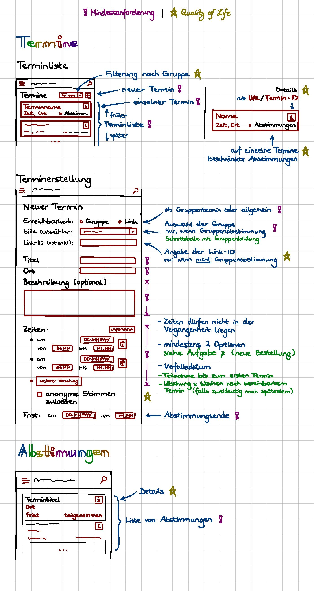
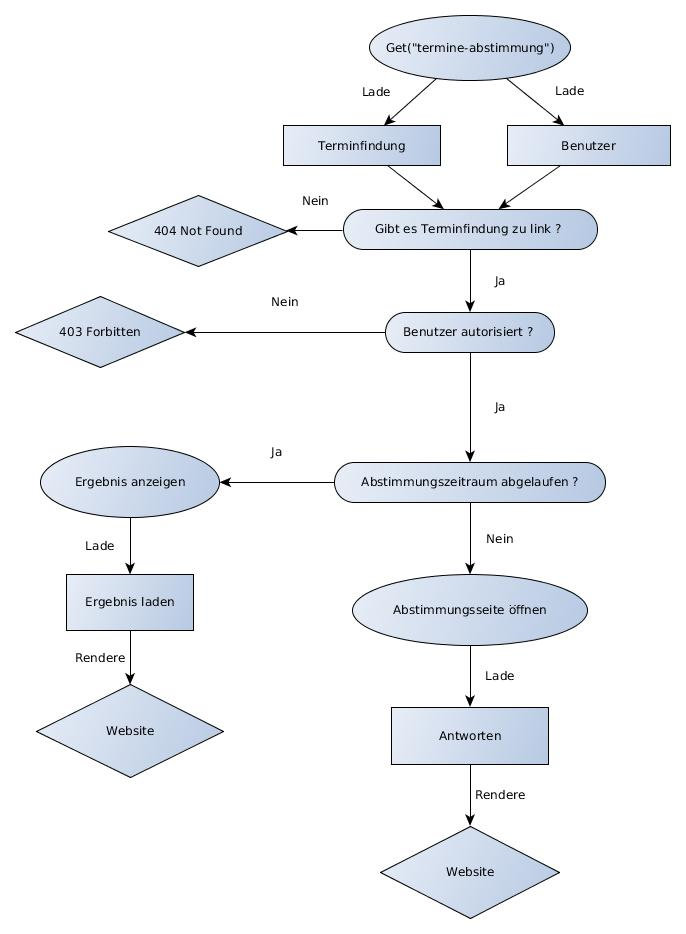
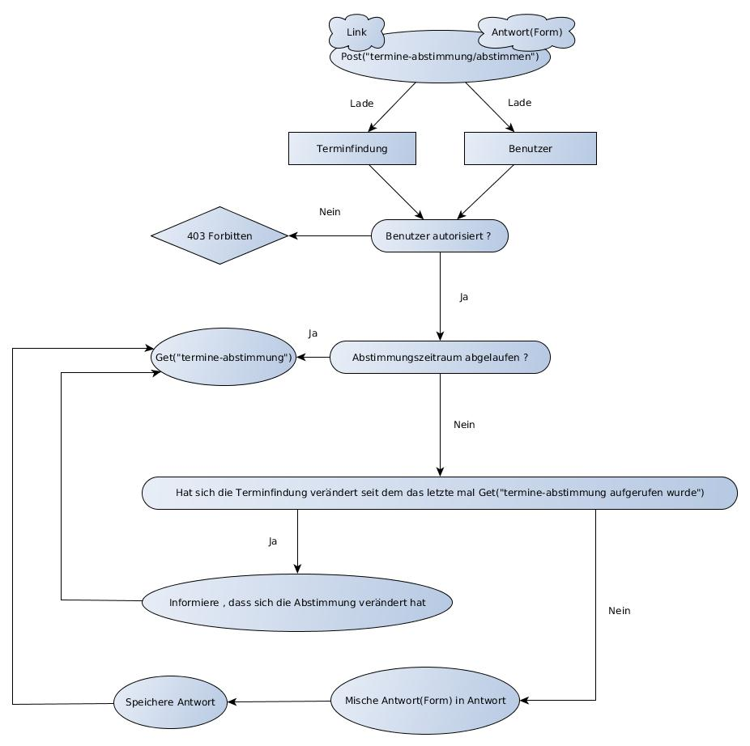

= Dokumentation Projekt Terminfindung

== Tag 1

Der erste Tag des Projektes begann mit einer Einführung für alle im Hörsaal und bestand insgesamt darin, die ersten Ideen für das System zur Terminfindung&Umfragen zu generieren. Dazu sollten wir ein Werbeplakat gestalten, dass die Hauptideen des Projektes beinhalten sollte und einen Bogen ausfüllen der uns geholfen hat unsere Ideen/Diskussion zu strukturieren.

== Tag 2

Als Basis des Projekts war die erste Aufgabe, die Geräte richtig zu konfigurieren. Dazu zählte die Installation von Checkstyle, SpotBugs etc. Weiter wurde in GitHub die Branch Protection und GitHub actions aktiviert, welches von Leon erledigt wurde. Anschließend daran wurde das Projekt mit SpringBoot als Gradle Projekt initialisiert. Diesen Teil haben Jan und Thomas übernommen. Der nächste Schritt war nun das Einbinden des Styleguides, welches Julia und Kathi erledigt haben. Danach hat Anton die erste Indexseite erstellt. Dort trat das erste Problem mit dem Logging Fenster auf, denn es war noch keine Security eingerichtet. Aus diesem Grunde wurde diese vorübergehend (in build.gradle) auskommentiert. Zeitgleich hat sich Marcel daran versucht, die docker-compose-Datei und das Dockerfile zu schreiben, welches in den Anforderungen gefragt war. Da es noch Unstimmigkeiten mit der Wahl der Datenbank gab, wurden diese Dateien noch nicht hochgeladen. Zudem wurden von Ingrid erste Konzepte für das Webdesign entwickelt.

Zum Abschluss des Tages haben wir uns über die verschiedenen Aufgaben ausgetauscht und die Erfolge bzw. Probleme zusammengetragen. Anschließend erfolgte noch ein kurzes Brainstorming über die anstehenden Aufgaben des nächsten Tages. Da dies sehr gut geklappt hat und einen guten Überblick über die absolvierten und anstehenden Aufgaben geliefert hat, haben wir beschlossen, dies ab jetzt jeden Tag durchzuführen.

== Tag 3

Die erste Aufgabe des Tages war eine gemeinsame erste Erarbeitung des Arc42 Templates. Anschließend haben wir noch einmal kurz die Aufgaben für den Tag auf kleine Gruppen von 2-3 Personen aufgeteilt.

=== Gruppe Checkstyle (Kathi, Leon)
Leon hatte bereits eine grundlegende Konfigurationsdatei für Checkstyle vorbereitet. Über den Tag sind wir durch die Dokumentation von Checkstyle gegangen und haben für die einzelnen Module entschieden, welche für unser Projekt Sinn machen. Am Ende des Tages sind ein paar Probleme aufgetreten, hauptsächlich bei dem Modul "Indentation", da dieses mit Tabs anders arbeitet als mit Leerzeichen. Wir haben uns entschieden, darüber am nächsten Tag weiter zu diskutieren, wie wir damit weiter vorgehen sollen.

=== Gruppe Datenbankmodell (Julia, Thomas, Marcel)
Unser erster Ansatz für das Datenbankmodell war die Erstellung des ER-Modells. Anschließend erfolgte eine erste Datenbankmodellierung mit MySQL Workbench. Nach dem ersten Upload des ER-Modells auf GitHub wurden wir von den Tutoren auf eine ungünstige Beziehung hingewiesen. Dies ist uns vorher nicht aufgefallen und wurde auch beim Datenbankschema umgesetzt. Daraufhin haben wir über eine alternative Modellierung nachgedacht und die Änderungen aus Zeitmangel auf den nächsten Tag verschoben.

=== Gruppe Web-Userinterface (Ingrid, Anton, Jan)
Da die Views einen uniformen visuellen Stil haben müssen, haben wir unsere (6 Stück) so aufgeteilt dass eine Person die Übesichtsviews, eine Person die Detailviews und eine Person die Formularviews übernimmt.
Wir haben angefangen die Sichten zu bauen, obwohl die Datenbank noch nicht fertig ist, weil wir schon abgesprochen haben welche Daten die Datenbank vom Interface bekommen soll und welche Inputfelder darin enthalten sein sollten.

=== Gruppe Klassen (Thomas,Jan)
Nachdem das Datenbankenteam auf die Problematik der Beziehung hingewiesen wurde und Jens uns den Tipp gab lieber mit der Geschäftslogik anzufangen, begannen wir uns zu überlegen welche Klassen
benötigt werden um das gewünschte Verhalten zu ermöglichen. Wir orientierten uns dabei aber noch immer zu sehr am Datenbankmodell.

== Tag 4

Die Aufgaben vom Vortag wurden größtenteils in den Gruppen fortgesetzt.

=== Gruppe Checkstyle (Kathi, Leon)
Heute haben wir ein paar Kleinigkeiten an der Checkstyle Konfigurationsdatei geändert. Unter anderem, dass eine Zeile bis zu 120 Zeichen enthalten werden darf und nur .java Dateien überprüft werden sollen. Die Module "MagicNumbers" und "MultipleStringLiterals" wurden auch rausgenommen, da dies für uns zu streng war. Das Modul "AvoidDoubleBraceInitialization" hat zu Problemen mit dem eclipse Checkstyle Plugin geführt, weswegen auch dieses rausgenommen wurde.
Außerdem wurden Module hinzugefügt, die die Namen von Variablen, Methoden etc überprüfen.
Als wir damit fertig waren, haben wir eclipse und IntelliJ so eingestellt, dass die automatische Formatierung der IDE zu keinen Fehlern mit Checkstyle führt und die entstandenden Dateien an die anderen Mitglieder des Teams verteilt, sodass der Umsprung auf das neue Format ohne Probleme erfolgen kann.

=== Gruppe Datenbankmodell/Klassen (Julia, Thomas, Marcel)
Die Aufgabe des Tages war, das Datenbankmodell erneut zu diskutieren, da das alte Modell verworfen wurde. Die Idee ist nun, von der Geschäftslogik ausgehend die Struktur zu modellieren, und sich danach Gedanken über das konkrete Datenbankmodell zu machen.

=== Gruppe Web-Userinterface (Ingrid, Anton, Jan)
Terminübersicht, Frist erkennbar, Link neuer Termin, Buttons, insgesamt UI, Abstimmung zu Umfragen **ausformulieren**

Zusätzlich dazu haben Marcel und Julia die Dokumentation für Tag 1-3 zusammengestellt und die Art und Weise geplant, wie die Dokumentation fortlaufend erweitert wird. Außerdem haben Thomas und Jan die ersten Entitäten mithilfe von Spring Data JPA erstellt (und annotiert), sodass demnächst die Datenbank dazu modelliert werden kann.

== Tag 5

=== Gruppe Config (Leon, Jan)
Checkstyle korrigiert, hier und da ausgeholfen, reviewed.
GitHub Actions ueberarbeitet so,dass gradle check ausgeführt wird.

=== Gruppe Gruppe Datenbankmodell/Klassen (Julia, Kathi, Thomas, Marcel)
Heute haben wir uns überlegt, wie man die Modell-Klassen anhand der Geschäftslogik am besten modellieren kann.
Anschließend wurden diese erstellt. Zudem wurden die Entities und Repositories geschrieben.
Zum Schluss haben wir über erste Testansätze gesprochen und entschlossen, am nächsten
Praktikumstag einen Database-Initializer zu schreiben, der Fake-Daten generiert.

=== Gruppe Web-Userinterface (Ingrid, Anton, Jan)
- UI weiter bearbeitet, Design für später, uniformes Aussehen, Thymeleaf bereit machen
Fehler aus HTML entfernt, Git Actions aktualisiert/verbessert, RequestMapping hinzugefügt, Ergebnisse in den Umfragelisten einsehbar

- Formatänderungen, Recherche, URL-Änderungen, Fehlercorrektur

== Tag 6

(Anton)
- thymeleaf für views angefangen, controller mit SessionScope annotiert, README überschrieben, UI bei Terminerstellung weiter geklärt

(Thomas, Anton)
application.properties mit H2 für development vorbereitet

(Thomas, Leon)
- Datenbank, Keycloak configs, Rollen bei Controllern
- Tests, welche momentan noch zu Problemen führen

Nachdem Keycloak soweit in das Projekt eingebunden war, hat sich Leon zu Thomas gesellt und gemeinsam haben
sie sich an den Tests versucht, da diese fehlgeschlagen sind. Dies lag daran, dass die Tests nur auf die Webseite
zugreifen wollten und sich nicht einloggen konnten. Die Versuche, die fehlschlagenden Tests mit @WithMockUser
zu beheben, haben noch nicht funktioniert, weswegen wir uns diese Aufgabe für den nächsten Tag vorgenommen haben.

=== Gruppe Gruppe Datenbankmodell/Klassen/erste Services (Kathi, Julia, Jan, Marcel, Leon)
Zunächst wurden sich grundlegende Gedanken zu dem Database Initializer gemacht, der am
Folgetag implementiert werden sollte. Zudem wurden noch kleine Fehlern in den Modell-Klassen korrigiert,
wie 'Date' zu 'LocalDateTime' geändert.  Insgesamt wurde die Entwicklung des Datenbankmodells mit einer
Review dieses Modells abgeschlossen. Außerdem wurden erste Ideen zu einem TerminfindungsService gesammelt,
sowie erste Strukturen dafür entworfen.

=== UI (Ingrid)
- pull request bearbeitet
- Probleme mit merge-Konflikt
- html Dateien überarbeitet

== Tag 7

=== Gruppe TerminfindungService (Anton, Jan, Marcel)
Die ersten Methoden für die Klasse TerminfindungService wurden geschrieben. Parallel zu den Methoden haben wir Tests geschrieben, um die Funktionalität zu prüfen. Da für zwei der Methoden im TerminfindungService Queries benötigt wurden, haben wir diese in der Klasse TerminfindungRepository explizit annotiert.

=== Gruppe Keycloak (Thomas, Leon)
Die zuerst verwendeten Annotations in der Controller Test Klasse haben mit Keycloak nicht funktioniert. Diese wurden dann abgeändert und durch @SpringBootTest erweitert. Außerdem wurde die Methode um ein Account-Objekt zu erstellen abgeändert, da bei den Test kein KeycloakToken, sonder ein Principal übergeben wurde und dieses die eMail-Adresse eines Benutzers nicht beinhaltet.
Leon hat die Fremdschlüsselbeziehungen in der Datenbank durch hinzufügen eines Dialektes in der application.properties hinzugefügt.

=== Gruppe DB-Initializer (Kathi, Julia)
Heute wurde damit begonnen, den Database Initializer zu schreiben, der zum Start der Anwendung die
Datenbank mit ersten Fake-Daten füllt. Insgesamt wurde die Tabelle "BenutzerGruppeDB" mit Daten gefüllt
und Methoden geschrieben, die eine Erstellung einer Terminfindung bzw. einer Umfrage eines Benutzers
für eine seiner Gruppen simuliert und die Daten speichert.

=== UI (Ingrid)
An Views weitergearbeitet

== Tag 8

=== Gruppe TerminfindungService und UmfrageService (Leon, Marcel, Jan)
Die Tests für TerminfindungService wurden weiter bearbeitet und verbessert. Währenddessen haben Leon und Marcel die ersten Methoden zu UmfrageService geschrieben. Parallel dazu wurden auch hier Tests zur Funktionalität des Services geschrieben. Die Orientierung lag hierbei am bereits vorhandenen TerminfindungService bzw die Tests dazu. 

=== Gruppe Thymeleaf (Thomas, Anton)
In der Übersicht für Terminfindungen wurden Thymeleaf-Attribute hinzugefügt. Zusätzlich wurden im zugehörigen Controller Testdaten eingefügt, die dann auf der Webseite angezeigt werden können.

=== Gruppe DB-Initializer (Kathi, Julia)
Zu dem Database-Initializer wurden nun die vorgegebenen Accounts von Keycloak hinzugefügt (studentinX und orgaX).
Zudem gewann der Database-Initializer an Methoden: Nun wurde ermöglicht,
Terminfindungen bzw. Umfragen für alle Nutzer (nicht auf eine Gruppe beschränkt) zu erstellen und die
Antworten wurden für Gruppen - Terminfindungen bzw. - Umfragen gespeichert.

=== UI (Ingrid)
An Views weitergearbeitet
Einiges am Design und funktionalität verbessert

== Tag 9

=== TerminfindungService(Jan)
Die von Thomas angemerkten Probleme wurden behoben, indem loadByErstellerOhneTermine und loadByGruppe ohne Termine erstellt bzw abgeändert wurden. Die Daten werden im Service gefiltert , nachdem eigentlich versucht wurde sich die Objekte direkt aus der Datenbank zu holen um so das eigene Filtern zu verhindern.
Den Service und de Tests ueberarbeitet , sodass wesentlich weniger 
Datenbankaufrufe notwendig sind, dies wurde durch  

=== DB (Thomas, Jan)

=== Gruppe UmfrageService (Leon, Marcel)
Die von Thomas angemerkten Fehler, dass beim Laden die Daten mehrfach angezeigt werden, wurde behoben, indem die beiden Methoden loadByErsteller und loadByGruppe überarbeitet wurden. Hierbei erfolgt nun eine Filterung der Daten im Service. Anschließend wurden auch die Tests nochmal überarbeitet und ergänzt.

=== Gruppe DB-Initializer (Kathi, Julia)
Heute wurde der DB-Initializer um Methoden zur Befüllung aller restlichen Datenbanktabellen erweitert. Kleinere
letzte Änderungen aufgrund einer Review wurden aus Zeitgründen auf den nächsten Tag verschoben. Zudem haben wir
den LinkService angefangen, der ein gültiges Link-Ende generiert oder ein übergebenes Link-Ende des Benutzers
auf Gültigkeit prüft. Die Tests sollen am nächsten Tag geschrieben werden.

=== Gruppe UI (Ingrid, Anton)
Wir haben an der Verbesserung der Oberfläche gearbeitet und die Übersicht der Umfragen hat die erste Hälfte an Thymeleaf bekommen, so dass dummy Daten aus dem Controller korrekt ausgelesen und angezeigt werden.

== Tag 10

=== TerminAntwortService(Jan,Marcel)
Es wurde am TerminAntwortService gearbeitet, dieser ist dazu zuständig die Antworten
eines Benutzers bezüglich einer bestimmten Terminumfrage zu Speichern und zu laden
Ebenso soll sie alle Antworten laden können um das Auswerten eines Ergebnisses zu 
ermöglichen.
Dabei eröffnet sich die Frage ob die Klasse für das berechnen des ergebnis zuständig 
sein sollte oder wirklich nur für das speichern und laden zum antworten.
Wegen des SingleResponsibility Prinzips wird das Berechnen des Ergebnisses in einer 
anderen Methode erfolgen. 

=== Gruppe UI (Anton, Ingrid)
Thymeleaf für Übersicht der Umfragen fertiggestellt und angefangen die Datenbank einzubinden.abstimmung, Umfragenabstimmung sind visuell fertig und brauchen jetzt Thymeleaf.
Sichten weiterentwickelt: Termin

=== Gruppe DB-Initializer/ LinkService (Kathi, Julia)
Der DB-Initializer wurde nun angepasst und fertiggestellt. Außerdem wurden heute Tests für den
LinkService geschrieben. Als letztes haben wir uns erste Gedanken darüber gemacht, wie man den
LinkService sinnvoll integrieren kann, um bei Erstellung einer neuen Terminfindung/ Umfrage
den Link zu prüfen. 

////
Ziele für die Woche:
- Review für das Datenbankmodell
- Zusammen erläutern der Aufteilung der Klassen
- Datenbank aufsetzen (vielleicht mal wirklich!)
- Webseite testen (POST Controller)
- Thymeleaf dazu schreiben
- erste Methoden für Business-Logik schreiben (falls funktionsfähig)

Wochenziel:
- grundlegende Anwendungen vorhanden
- Kombi funktioniert
////

== Tag 11

=== Abstimmungsfunktion(Jan)
Ziel wer es den Controller für die View termine-abstimmen anzulegen und dabei die abstimmungsfunktion zu implementieren. Jedoch musste noch auf einige pull requests gewartet werden. Weshalb ablaufpläne erstellt wurden

=====  Get(termine-abstimmung)

Eine Schwierigkeit , bei der über die Änderung einiger Methoden aus dem 
TermineAntwortService nachgedacht werden könnte , ist wie die Antwort geladen 
wird . Was wenn sich seit dem letzten Antworten eines Nutzers die Umfrage 
geändert hat(dabei will ich außer acht lassen , dass höchstens Termine 
hinzugefügt werden können , um den Code möglichst allgemein Zu halten)
Es wäre eine Möglichkeit die geladene Antwort Klasse mit allen 
Antwortmöglichkeiten aufzufüllen und dann die Antworten für die jeweiligen 
Möglichkeiten zu laden.

===== Post(termine-abstimmung)

Eine Schwierigkeit wird es sein festzuhalten, zu welchem Termin 
eine Antwort gehört. Eine Lösung wäre es die Reihenfolge zu beachten, in der 
die TerminOptionen und Antworten stehen. Es sollte dann aber überprüft werden 
ob sich die Umfrage seit dem Letzten aufrufen geändert hat.(Evtl mit einer Map)
(Es eröffnet sich eine weitere Schwierigkeit. Bisher wird berprüft ob ein 
Student an einer Umfrage teilgenommen hat , indem überprüft wird ob Antworten 
von ihm in der Tabelle stehen. Wenn die AbstimmungsOptionen aber verändert wurden , ergibt es durchaus Sinn, ihn nochmal in der Übersicht anzuzeigen , dass er abstimmen sollte, ohne seine alten Antworten zu löschen (Wenn z.B eine Option hinzugekommt oder gelöscht wurde))