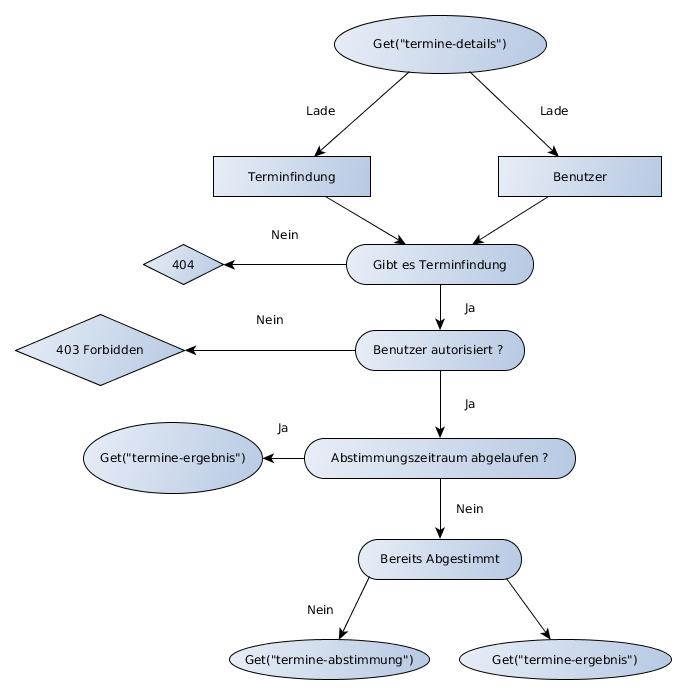
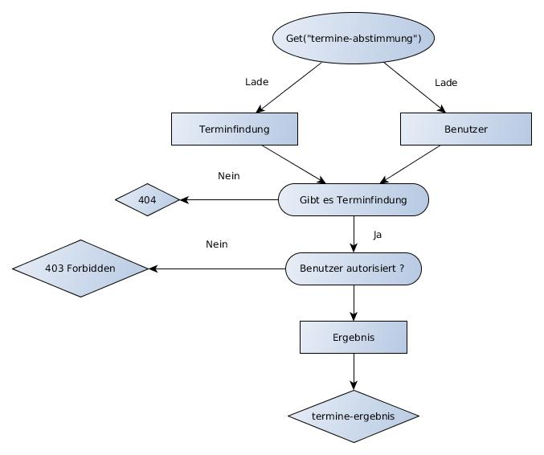

= Dokumentation Projekt Terminfindung

== Tag 1

Der erste Tag des Projektes begann mit einer Einführung für alle im Hörsaal und bestand insgesamt darin, die ersten Ideen für das System zur Terminfindung&Umfragen zu generieren.
Dazu sollten wir ein Werbeplakat gestalten, dass die Hauptideen des Projektes beinhalten sollte und einen Bogen ausfüllen der uns geholfen hat unsere Ideen/Diskussion zu strukturieren.

== Tag 2

Als Basis des Projekts war die erste Aufgabe, die Geräte richtig zu konfigurieren.
Dazu zählte die Installation von Checkstyle, SpotBugs etc.
Weiter wurde in GitHub die Branch Protection und GitHub actions aktiviert, welches von Leon erledigt wurde.
Anschließend daran wurde das Projekt mit SpringBoot als Gradle Projekt initialisiert.
Diesen Teil haben Jan und Thomas übernommen.
Der nächste Schritt war nun das Einbinden des Styleguides, welches Julia und Kathi erledigt haben.
Danach hat Anton die erste Indexseite erstellt.
Dort trat das erste Problem mit dem Logging Fenster auf, denn es war noch keine Security eingerichtet.
Aus diesem Grunde wurde diese vorübergehend (in build.gradle) auskommentiert.
Zeitgleich hat sich Marcel daran versucht, die docker-compose-Datei und das Dockerfile zu schreiben, welches in den Anforderungen gefragt war.
Da es noch Unstimmigkeiten mit der Wahl der Datenbank gab, wurden diese Dateien noch nicht hochgeladen.
Zudem wurden von Ingrid erste Konzepte für das Webdesign entwickelt.

Zum Abschluss des Tages haben wir uns über die verschiedenen Aufgaben ausgetauscht und die Erfolge bzw.
Probleme zusammengetragen.
Anschließend erfolgte noch ein kurzes Brainstorming über die anstehenden Aufgaben des nächsten Tages.
Da dies sehr gut geklappt hat und einen guten Überblick über die absolvierten und anstehenden Aufgaben geliefert hat, haben wir beschlossen, dies ab jetzt jeden Tag durchzuführen.

== Tag 3

Die erste Aufgabe des Tages war eine gemeinsame erste Erarbeitung des Arc42 Templates.
Anschließend haben wir noch einmal kurz die Aufgaben für den Tag auf kleine Gruppen von 2-3 Personen aufgeteilt.

=== Gruppe Checkstyle (Kathi, Leon)

Leon hatte bereits eine grundlegende Konfigurationsdatei für Checkstyle vorbereitet.
Über den Tag sind wir durch die Dokumentation von Checkstyle gegangen und haben für die einzelnen Module entschieden, welche für unser Projekt Sinn machen.
Am Ende des Tages sind ein paar Probleme aufgetreten, hauptsächlich bei dem Modul "Indentation", da dieses mit Tabs anders arbeitet als mit Leerzeichen.
Wir haben uns entschieden, darüber am nächsten Tag weiter zu diskutieren, wie wir damit weiter vorgehen sollen.

=== Gruppe Datenbankmodell (Julia, Thomas, Marcel)

Unser erster Ansatz für das Datenbankmodell war die Erstellung des ER-Modells.
Anschließend erfolgte eine erste Datenbankmodellierung mit MySQL Workbench.
Nach dem ersten Upload des ER-Modells auf GitHub wurden wir von den Tutoren auf eine ungünstige Beziehung hingewiesen.
Dies ist uns vorher nicht aufgefallen und wurde auch beim Datenbankschema umgesetzt.
Daraufhin haben wir über eine alternative Modellierung nachgedacht und die Änderungen aus Zeitmangel auf den nächsten Tag verschoben.

=== Gruppe Web-Userinterface (Ingrid, Anton, Jan)

Da die Views einen uniformen visuellen Stil haben müssen, haben wir unsere (6 Stück) so aufgeteilt dass eine Person die Übesichtsviews, eine Person die Detailviews und eine Person die Formularviews übernimmt.
Wir haben angefangen die Sichten zu bauen, obwohl die Datenbank noch nicht fertig ist, weil wir schon abgesprochen haben welche Daten die Datenbank vom Interface bekommen soll und welche Inputfelder darin enthalten sein sollten.

=== Gruppe Klassen (Thomas,Jan)

Nachdem das Datenbankenteam auf die Problematik der Beziehung hingewiesen wurde und Jens uns den Tipp gab lieber mit der Geschäftslogik anzufangen, begannen wir uns zu überlegen welche Klassen benötigt werden um das gewünschte Verhalten zu ermöglichen.
Wir orientierten uns dabei aber noch immer zu sehr am Datenbankmodell.

== Tag 4

Die Aufgaben vom Vortag wurden größtenteils in den Gruppen fortgesetzt.

=== Gruppe Checkstyle (Kathi, Leon)

Heute haben wir ein paar Kleinigkeiten an der Checkstyle Konfigurationsdatei geändert.
Unter anderem, dass eine Zeile bis zu 120 Zeichen enthalten werden darf und nur .java Dateien überprüft werden sollen.
Die Module "MagicNumbers" und "MultipleStringLiterals" wurden auch rausgenommen, da dies für uns zu streng war.
Das Modul "AvoidDoubleBraceInitialization" hat zu Problemen mit dem eclipse Checkstyle Plugin geführt, weswegen auch dieses rausgenommen wurde.
Außerdem wurden Module hinzugefügt, die die Namen von Variablen, Methoden etc überprüfen.
Als wir damit fertig waren, haben wir eclipse und IntelliJ so eingestellt, dass die automatische Formatierung der IDE zu keinen Fehlern mit Checkstyle führt und die entstandenden Dateien an die anderen Mitglieder des Teams verteilt, sodass der Umsprung auf das neue Format ohne Probleme erfolgen kann.

=== Gruppe Datenbankmodell/Klassen (Julia, Thomas, Marcel)

Die Aufgabe des Tages war, das Datenbankmodell erneut zu diskutieren, da das alte Modell verworfen wurde.
Die Idee ist nun, von der Geschäftslogik ausgehend die Struktur zu modellieren, und sich danach Gedanken über das konkrete Datenbankmodell zu machen.

=== Gruppe Web-Userinterface (Ingrid, Anton, Jan)

Terminübersicht, Frist erkennbar, Link neuer Termin, Buttons, insgesamt UI, Abstimmung zu Umfragen **ausformulieren**

Zusätzlich dazu haben Marcel und Julia die Dokumentation für Tag 1-3 zusammengestellt und die Art und Weise geplant, wie die Dokumentation fortlaufend erweitert wird.
Außerdem haben Thomas und Jan die ersten Entitäten mithilfe von Spring Data JPA erstellt (und annotiert), sodass demnächst die Datenbank dazu modelliert werden kann.

== Tag 5

=== Gruppe Config (Leon, Jan)

Checkstyle korrigiert, hier und da ausgeholfen, reviewed.
GitHub Actions ueberarbeitet so,dass gradle check ausgeführt wird.

=== Gruppe Gruppe Datenbankmodell/Klassen (Julia, Kathi, Thomas, Marcel)

Heute haben wir uns überlegt, wie man die Modell-Klassen anhand der Geschäftslogik am besten modellieren kann.
Anschließend wurden diese erstellt.
Zudem wurden die Entities und Repositories geschrieben.
Zum Schluss haben wir über erste Testansätze gesprochen und entschlossen, am nächsten Praktikumstag einen Database-Initializer zu schreiben, der Fake-Daten generiert.

=== Gruppe Web-Userinterface (Ingrid, Anton, Jan)

- UI weiter bearbeitet, Design für später, uniformes Aussehen, Thymeleaf bereit machen Fehler aus HTML entfernt, Git Actions aktualisiert/verbessert, RequestMapping hinzugefügt, Ergebnisse in den Umfragelisten einsehbar

- Formatänderungen, Recherche, URL-Änderungen, Fehlercorrektur

== Tag 6

(Anton)
- thymeleaf für views angefangen, controller mit SessionScope annotiert, README überschrieben, UI bei Terminerstellung weiter geklärt

(Thomas, Anton) application.properties mit H2 für development vorbereitet

(Thomas, Leon)
- Datenbank, Keycloak configs, Rollen bei Controllern
- Tests, welche momentan noch zu Problemen führen

Nachdem Keycloak soweit in das Projekt eingebunden war, hat sich Leon zu Thomas gesellt und gemeinsam haben sie sich an den Tests versucht, da diese fehlgeschlagen sind.
Dies lag daran, dass die Tests nur auf die Webseite zugreifen wollten und sich nicht einloggen konnten.
Die Versuche, die fehlschlagenden Tests mit @WithMockUser zu beheben, haben noch nicht funktioniert, weswegen wir uns diese Aufgabe für den nächsten Tag vorgenommen haben.

=== Gruppe Gruppe Datenbankmodell/Klassen/erste Services (Kathi, Julia, Jan, Marcel, Leon)

Zunächst wurden sich grundlegende Gedanken zu dem Database Initializer gemacht, der am Folgetag implementiert werden sollte.
Zudem wurden noch kleine Fehlern in den Modell-Klassen korrigiert, wie 'Date' zu 'LocalDateTime' geändert.
Insgesamt wurde die Entwicklung des Datenbankmodells mit einer Review dieses Modells abgeschlossen.
Außerdem wurden erste Ideen zu einem TerminfindungsService gesammelt, sowie erste Strukturen dafür entworfen.

=== UI (Ingrid)

- pull request bearbeitet
- Probleme mit merge-Konflikt
- html Dateien überarbeitet

== Tag 7

=== Gruppe TerminfindungService (Anton, Jan, Marcel)

Die ersten Methoden für die Klasse TerminfindungService wurden geschrieben.
Parallel zu den Methoden haben wir Tests geschrieben, um die Funktionalität zu prüfen.
Da für zwei der Methoden im TerminfindungService Queries benötigt wurden, haben wir diese in der Klasse TerminfindungRepository explizit annotiert.

=== Gruppe Keycloak (Thomas, Leon)

Die zuerst verwendeten Annotations in der Controller Test Klasse haben mit Keycloak nicht funktioniert.
Diese wurden dann abgeändert und durch @SpringBootTest erweitert.
Außerdem wurde die Methode um ein Account-Objekt zu erstellen abgeändert, da bei den Test kein KeycloakToken, sonder ein Principal übergeben wurde und dieses die eMail-Adresse eines Benutzers nicht beinhaltet.
Leon hat die Fremdschlüsselbeziehungen in der Datenbank durch hinzufügen eines Dialektes in der application.properties hinzugefügt.

=== Gruppe DB-Initializer (Kathi, Julia)

Heute wurde damit begonnen, den Database Initializer zu schreiben, der zum Start der Anwendung die Datenbank mit ersten Fake-Daten füllt.
Insgesamt wurde die Tabelle "BenutzerGruppeDB" mit Daten gefüllt und Methoden geschrieben, die eine Erstellung einer Terminfindung bzw. einer Umfrage eines Benutzers für eine seiner Gruppen simuliert und die Daten speichert.

=== UI (Ingrid)

An Views weitergearbeitet

== Tag 8

=== Gruppe TerminfindungService und UmfrageService (Leon, Marcel, Jan)

Die Tests für TerminfindungService wurden weiter bearbeitet und verbessert.
Währenddessen haben Leon und Marcel die ersten Methoden zu UmfrageService geschrieben.
Parallel dazu wurden auch hier Tests zur Funktionalität des Services geschrieben.
Die Orientierung lag hierbei am bereits vorhandenen TerminfindungService bzw die Tests dazu.

=== Gruppe Thymeleaf (Thomas, Anton)

In der Übersicht für Terminfindungen wurden Thymeleaf-Attribute hinzugefügt.
Zusätzlich wurden im zugehörigen Controller Testdaten eingefügt, die dann auf der Webseite angezeigt werden können.

=== Gruppe DB-Initializer (Kathi, Julia)

Zu dem Database-Initializer wurden nun die vorgegebenen Accounts von Keycloak hinzugefügt (studentinX und orgaX).
Zudem gewann der Database-Initializer an Methoden: Nun wurde ermöglicht, Terminfindungen bzw.
Umfragen für alle Nutzer (nicht auf eine Gruppe beschränkt) zu erstellen und die Antworten wurden für Gruppen - Terminfindungen bzw.
- Umfragen gespeichert.

=== UI (Ingrid)

An Views weitergearbeitet Einiges am Design und funktionalität verbessert

== Tag 9

=== TerminfindungService(Jan)

Die von Thomas angemerkten Probleme wurden behoben, indem loadByErstellerOhneTermine und loadByGruppe ohne Termine erstellt bzw abgeändert wurden.
Die Daten werden im Service gefiltert , nachdem eigentlich versucht wurde sich die Objekte direkt aus der Datenbank zu holen um so das eigene Filtern zu verhindern.
Den Service und de Tests ueberarbeitet , sodass wesentlich weniger Datenbankaufrufe notwendig sind, dies wurde durch

=== DB (Thomas, Jan)

Es ist aufgefallen, dass beim Laden der Terminfindungen die Daten mehrfach vorhanden sind und zu viele Datenbankaufrufe gemacht werden. Das liegt an der vorhandenen Redunzanz in der Datenbank.
Diese Probleme wurden von Leon und Marcel behoben.
Währenddessen wurde ein Service für die Termin Übersicht geschrieben, welcher die vorhandenen Termine für einen Benutzer lädt und diese dem Controller der Übersicht aufgeteilt in bereits abgeschlossene und noch offene Terminabstimmungen bereitstellt. Zusätzlich wurde ein Service geschrieben, der alle Gruppen für einen Benutzer bereitstellt.

=== Gruppe UmfrageService (Leon, Marcel)

Die von Thomas angemerkten Fehler, dass beim Laden die Daten mehrfach angezeigt werden, wurde behoben, indem die beiden Methoden loadByErsteller und loadByGruppe überarbeitet wurden.
Hierbei erfolgt nun eine Filterung der Daten im Service.
Anschließend wurden auch die Tests nochmal überarbeitet und ergänzt.

=== Gruppe DB-Initializer (Kathi, Julia)

Heute wurde der DB-Initializer um Methoden zur Befüllung aller restlichen Datenbanktabellen erweitert.
Kleinere letzte Änderungen aufgrund einer Review wurden aus Zeitgründen auf den nächsten Tag verschoben.
Zudem haben wir den LinkService angefangen, der ein gültiges Link-Ende generiert oder ein übergebenes Link-Ende des Benutzers auf Gültigkeit prüft.
Die Tests sollen am nächsten Tag geschrieben werden.

=== Gruppe UI (Ingrid, Anton)

Wir haben an der Verbesserung der Oberfläche gearbeitet und die Übersicht der Umfragen hat die erste Hälfte an Thymeleaf bekommen, so dass dummy Daten aus dem Controller korrekt ausgelesen und angezeigt werden.

== Tag 10

=== TerminAntwortService(Jan,Marcel)

Es wurde am TerminAntwortService gearbeitet, dieser ist dazu zuständig die Antworten eines Benutzers bezüglich einer bestimmten Terminumfrage zu Speichern und zu laden Ebenso soll sie alle Antworten laden können um das Auswerten eines Ergebnisses zu ermöglichen.
Dabei eröffnet sich die Frage ob die Klasse für das berechnen des ergebnis zuständig sein sollte oder wirklich nur für das speichern und laden zum antworten.
Wegen des SingleResponsibility Prinzips wird das Berechnen des Ergebnisses in einer anderen Methode erfolgen.

=== Gruppe UI (Anton, Ingrid)

Thymeleaf für Übersicht der Umfragen fertiggestellt und angefangen die Datenbank einzubinden.abstimmung, Umfragenabstimmung sind visuell fertig und brauchen jetzt Thymeleaf.
Sichten weiterentwickelt: Termin

=== Gruppe DB-Initializer/ LinkService (Kathi, Julia)
Der DB-Initializer wurde nun angepasst und fertiggestellt.
Außerdem wurden heute Tests für den LinkService geschrieben.
Als letztes haben wir uns erste Gedanken darüber gemacht, wie man den LinkService sinnvoll integrieren kann, um bei Erstellung einer neuen Terminfindung/ Umfrage den Link zu prüfen.

=== Gruppe Urlaub (Thomas)

////
Ziele für die Woche:
- Review für das Datenbankmodell
- Zusammen erläutern der Aufteilung der Klassen
- Datenbank aufsetzen (vielleicht mal wirklich!)
- Webseite testen (POST Controller)
- Thymeleaf dazu schreiben
- erste Methoden für Business-Logik schreiben (falls funktionsfähig)

Wochenziel:
- grundlegende Anwendungen vorhanden
- Kombi funktioniert
////

== Tag 11

=== Abstimmungsfunktion(Termine)(Jan)

Ziel wer es den Controller für die View termine-abstimmen anzulegen und dabei die Abstimmungsfunktion zu implementieren.
Jedoch musste noch auf einige PullRequests gewartet werden.
Weshalb Ablaufpläne erstellt wurden.

=====  Get(termine-abstimmung)

Eine Schwierigkeit , bei der über die Änderung einiger Methoden aus dem TermineAntwortService nachgedacht werden könnte , ist wie die Antwort geladen wird . Was wenn sich seit dem letzten Antworten eines Nutzers die Umfrage geändert hat(dabei will ich außer acht lassen , dass höchstens Termine hinzugefügt werden können , um den Code möglichst allgemein Zu halten) Es wäre eine Möglichkeit die geladene Antwort Klasse mit allen Antwortmöglichkeiten aufzufüllen und dann die Antworten für die jeweiligen Möglichkeiten zu laden.

===== Post(termine-abstimmung)

image::ourimages/tag11/flussDiaPostAbstimmung.jpg[]

Eine Schwierigkeit wird es sein festzuhalten, zu welchem Termin eine Antwort gehört.
Eine Lösung wäre es die Reihenfolge zu beachten, in der die TerminOptionen und Antworten stehen.
Es sollte dann aber überprüft werden ob sich die Umfrage seit dem Letzten aufrufen geändert hat.(Evtl mit einer Map) (Es eröffnet sich eine weitere Schwierigkeit.
Bisher wird berprüft ob ein Student an einer Umfrage teilgenommen hat , indem überprüft wird ob Antworten von ihm in der Tabelle stehen.
Wenn die Abstimmungsoptionen aber verändert wurden , ergibt es durchaus Sinn, ihn nochmal in der Übersicht anzuzeigen , dass er abstimmen sollte, ohne seine alten Antworten zu löschen (Wenn z.B eine Option hinzugekommt oder gelöscht wurde))

=== Terminfindung Übersicht, Auslagerung (Thomas)

Der Service für die Termin Übersicht wurde vorerst fertiggestellt. Die bereits abgeschlossenen Termine werden bisher noch nicht korrekt sortiert, was später verbessert wird.
Außerdem wurden der vorhandene Controller in jeweils einen Controller für jede html-Seite aufgeteilt um das parallele Arbeiten und die Übersicht zu vereinfachen. Zusätzlich wurde das Erstellen der Account Objekte in einen eigenen Service ausgelagert, da dieser in jeden Controller benötigt wird.

=== (Anton)
Eigene Icons für Sidebar hergestellt und in HTML eingebunden.
Checkstyle angepasst damit Bilder ignoriert werden.
Am Kommentarservice mitgearbeitet.
TempusDominus recherchiert.

=== Gruppe KommentarService (Kathi, Julia, Anton)
Wir haben die Klasse Kommentar zu den model-Klassen hinzugefügt und einen KommentarService geschrieben.

=== Gruppe LinkService/ KommentarService (Julia, Kathi)
Der LinkService wurde korrigiert und in den Master gemerged. Wir haben Tests zum Kommentarservice hinzugefügt
und im KommentarService wurde die delete Methode geändert.

=== UmfrageAntwortService (Marcel)
Der UmfrageAntwortService wurde erstellt und analog zum TerminAntwortService wurden die benötigten Methoden geschrieben. Passend dazu wurden auch Tests hinzugefügt, um die jeweiligen Methoden zu testen. Eventuell bleiben noch Änderungen offen. Dies ergibt sich aus weiteren Erfahrungen mit anderen Teilen des Projektes. 

== Tag 12

=== Implementierung der Antwort-Funktion(Termine)(Jan)

Umsetzung der Plane des Vortages bezüglich der Logik der das Abstimmen unterliegt, einiges in den Services geändert um Code
wiederverwertbar und die Methoden einfach zu hakten.
Das Thymeleaf in der Abstimmungsseite wurde geschrieben.
Es muss nun noch Debuggt werden. 

=== UI (Ingrid, Anton, Thomas)
Views für Formulare fertiggestellt (neuer Termin/ neue Bestellung)
Thymeleaf für Umfragenübersicht gemacht und notwendigen controller und service geschrieben.
Controller für neue Termine geschrieben

=== DB-Initializer/ KommentarService (Julia, Kathi)
Nach Wünschen der anderen Teammitglieder haben wir den DB-Initializer so erweitert, dass für
studentin1, studentin2 und studentin3 immer eine Terminumfrage und eine Umfrage erstellt wrid.
Für die Methode loadByLink im Kommentarservice haben wir Tests hinzugefügt. Aufgrund eines fehlschlagenden
Tests haben wir Fehler im Kommentarservice entdeckt und korrigiert.

=== UmfrageService (Leon, Marcel)
Ein Fehler im Test wurde behoben und anschließend war die Bearbeitung dieser Klasse fertiggestellt.

=== GruppeController (Leon, Marcel)
Es wurden erste Überlegungen mit der Schnittstelle zum Projekt Gruppenbildung gemacht. Dazu wurden die Api und die angegebenen get-Anfragen sowie deren Rückgabe analysiert. Hier waren einige Fragen offen, welche durch die Tutoren beantwortet werden konnten. Eine Frage war beispielsweise, woher wir die groupIds bekommen, die für getGroup benötigt werden. Diese hat sich dadurch geklärt, dass die Anfrage updateGroups bereits alle nötigen Informationen (alle Gruppen mit Inhalt, die bis zur angegebenen Statusnummer geändert wurden) liefert. Dies hat in sofern geholfen, da uns vorher nicht klar war, welche Bedeutung die Statusnummer hat.

== Tag 13

=== (Ingrid, Anton, Thomas)
Beim erstellen neuer Terminfindungen können jetzt einzelne Terminvorschläge hinzugefügt und entfernt werden. Die Funktionalität nach Gruppen zu filtern wurde in der Terminübersicht hinzugefügt. Hierzu werden alle Gruppen eines Benutzers in einme Dropdown Menü angezeigt.
re-direct zu Details,
Controller für neue Termine fertiggestellt,
Button für Gruppenauswahl auf Übersichtsseite zeigt richtige Gruppe an

=== Implementierung der Antwort-Funktion und des Ergebnis(Jan)

Beim Debugging mussten einige NullPointer gelöst werden , weshalb einig Services 
angepasst und ein wenig refactored wurden.
Das Loeschen von einträgen über die Query "deleteAllByTerminfindungLinkAndBenutzer" 
funktionierte nicht , Lösung: 
Die zu Löschende Objekte Laden und erst dann mit delete(Objekte) Löschen.

Zudem gab es einige Fehler , die wohl auftraten , da die Datenbank noch ein veraltetes 
schema hatte,docker-compose down, docker-Compose up löste das Problem.
Anschließend weiter geplant wie das Ergebnis angezeigt werden sollte.

Alls alle Probleme gelößt wurden ging es ans Refactoring.
Dabei wurde auch Nachgedacht wie das Ergebnis angezeigt werden könnte: 
Und die Grundlagen für die Implementierung geschaffen

=== GruppeScheduler (Leon, Marcel)
Zum Testen der Schnittstelle zur Gruppe Gruppenbildung haben wir uns überlegt, ein Programm zu schreiben, welches Antworten für die nötige Anfrage liefert. Dabei gab es zunächst ein paar Probleme, die JSON-Objekte richtig zurückzugeben. Die Lösung des Problems war anschließend, ein ResponseEntity zu verwenden, da vorher lediglich ein reiner String verwendet wurde. Bevor wir mit dem GruppeScheduler begonnen haben, klärten wir einige Fragen mit den Tutoren. Unter anderem haben wir geklärt, welche Informationen uns die API der Gruppenbildung liefert und welche Anfragen für uns relevant sind. Im Anschluss haben wir die ersten Ansätze umgesetzt und mit unserem Testprogramm zwischenzeitlich getestet. Dabei gab es noch einen Fehler, dass die Scheduled-Methode nicht ausgeführt wird. Dieser Fehler lag darin, dass wir noch die Annotation @RequestMapping("/termine2") verwendet haben. Am Ende gab es noch eine NullPointerException beim Speichern der Objekte. Für dieses Problem reichte allerdings die Zeit nicht mehr und es wurde auf den nächsten Tag verschoben.

=== Fehlerbehebung und Import (Kathi, Julia)
Zunächst haben wir Jan den Großteil des Tages beim Debugging und bei der Fehlersuche geholfen. Anschließend
haben wir uns Gedanken über den Import von Terminen in einer CSV-Datei bei der Erstellung einer neuen Terminfindung gemacht.
Dazu haben wir die Möglichkeiten dafür recherchiert und erste Pläne aufgestellt.

== Tag 14 

=== Implementierung der Antwort-Funktion und des Ergebnis oder auch TerminAbstimmungsDetails(Jan)
Bei dem Refactoring und dem Anzeigen des Ergebnisses ist einiges an Logik 
hinzugekommen , welches wieder in Form von Flussdiagrammen versucht wurde Festzuhalten.
Da das Abstimmen bei den Umfragen ähnlich Ablaufen wird , wurden einige Kommentare
hinzugefügt , die Anlässlich der Implementierung des Abstimmens für Umfragen Beachtung 
finden könnten.

==== Details
Wenn termine2/link aufgerufen wird wird entschieden ob die Abstimmung oder Ergebnisseite Angezeigt wird : 

Kommentar : Es könnte Logik eingefügt werden um sicher zu stellen , dass das Ergebnis erst nach der Frist angezeigt wird.
(Abhängig von der Abstimmung (Interessant für die Umfrage)) 

==== Abstimmungs Übersicht
Wenn termine2/link/abstimmung aufgerufen wird gelangt man auf die Abstimmungs-Seite der Umfrage "link"
Auf der Seite werden die Informationen zur Terminfindung angezeigt und 
es besteht die Möglichkeit über die Termine abzustimmen und über einen Post abzustimmen , danach wird man auf die Ergebnis Seite Umgeleitet. 

image::ourimages/tag14/get-termine-abstimmung.jpg[]
Kommentar : Hier könnte noch Logik eingefügt um den Nutzer zu informieren wie viele Stimmen er hat.

==== Post Abstimmen

image::ourimages/tag14/post-termine-abstimmung.jpg[]
Kommentar : Hier könnte noch Logik eingefügt werden, um 
sicherzustellen, dass ein Nutzer nur eine feste Anzahl 
an Stimmen hat die er abgibt und wenn die Regel nicht 
erfüllt, des weiteren könnte Logik von Nöten sein ,
die zum Beispiel prüft ob der Nutzer bereits abgestimmt 
hat ,um Änderungen der Abstimmung zu vermeiden
(Abhängig vom Abstimmungsmodus(Eher für Umfrage interessant)) 

==== get-Ergebnis
Das (Zwischen)Ergebnis wird Angezeigt wenn der Link termine2/link/ergebnis aufgerufen wird und wenn man zumindest schon einmal einmal Abgestimmt hat.
(Ansonsten redirect zur Abstimmung )
Es ist ein Button dort , der auf die Abstimmung verweißt um seine Wahl zu ändern.

Kommentar:
Der Button müsste bei Umfragen evtl. entfernt werden 
(abhängig von der Umfrage)
Es könnte Logik eingefügt werden um sicher zu stellen , 
dass das Ergebnis erst nach der Frist angezerigt wird 
oder erst wenn jemand abgestimmt hat
(Abhängik von der Abstimmung (Interessant für die 
Umfrage))

=== Terminübersicht (Thomas)
In der Terminübersicht werden jetzt alle relevanten Termine für einen Benutzer angezeigt inklusive der Termine, die nur über einen Link erreichbar sind, an denen der Benutzer aber bereits teilgenommen hat. Die abgeschlossenen Termine (Termine, bei denen die Frist bereits abgelaufen ist) werden nach dem Ergebnis der Abstimmung sortiert. Dabei werden die aös nächstes anstehenden Termine oben angezeigt und die, die bereits in der Vergangenheit liegen ganz unten.

=== Neue Umfrage (Anton)
GetMapping und PostMappings geschrieben damit man im Formular neue Umfragen Vorschläge hinzufügen kann
und die entsprechende HTML Seite um nötige Thymeleaf Attribute erweitert.

=== GruppeScheduler (Leon, Marcel)
Erstes Thema war die Problembehebung der NullPointerException. Dieses haben wir während der Videokonferenz in Jitsi behoben, indem wir an das Repository die Annotation @Autowired geschrieben haben. Nachdem dies nun funktioniert, haben wir als nächstes die Implementierung des Löschens einer Gruppe vorgenommen. Dies geschieht, wenn beim Request an die API der Gruppenbildung der Titel der Gruppe "null" ist. Bei den anschließenden Tests ist uns aufgefallen, dass die Daten bei einer Änderung mehrfach gespeichert werden, anstatt dass die vorhandenen Daten geändert werden. Um dies effizient zu realisieren haben wir uns überlegt, eine Differenz zwischen den aktuellen Benutzern und den übergebenen Benutzern zu bilden. So werden neue Benutzer gespeichert, bereits gespeicherte Benutzer werden nicht verändert und nicht mehr enthaltene Benutzer werden gelöscht. Um diese Änderungen zu testen, haben wir noch einmal Änderungen an unserem Hilfsprogramm vorgenommen. Anschließend war der GruppeScheduler zu dem Zeitpunkt fertiggestellt.

=== ImportService (Kathi und Julia)
Wir haben die Klasse für den ImportService geschrieben und ein POST in TermineNeuController
hinzugefügt. Es wurden erste Versuche unternommen, den Upload in termine-neu.html zu integrieren,
allerdings hat es aufgrund eines Fehler noch nicht ganz funktioniert (der Controller wurde nicht
aufgerufen). Dies sollte am folgenden Tag behoben werden.

=== UI Neue Umfragen (Anton, Ingrid)
Formular für neue Termine wurde komplett überholt und die UX (Funktion/Optik) wurde deutlich verbessert.
Formular für neue Umfragen ist jetzt vollständig mit allen input Komponenten und die VIEW ist verfollständigt und überarbeitet worden. Jetzt werden falsche Eingaben korrekt abgefangen und die Bedienung ist einfacher.

== Tag 15

=== Ergebnis und Ansicht(Jan)(Tag15 und Wochenende)
Die Ergebnis Ansicht wurde für den Nutzer intuitiver gestaltet und mit mehr informationen gefüllt.
So hat der Nutzer nun einen Blick darauf , wer wie abgestimmt hat und wie viele ja nein vielleicht Stimmen ein Termin bekommen hat.
Die Anzeige eines Termins wurde Formatiert (z.B Sa. 09.11.2020 19:08),
da sich die Standartformatierungen von LocalDateTime nicht anboten.
Es gibt nun eine Art Legende.

image::ourimages/tag15/ergebnis.png[]

Mit einem Klick auf eine Terminszeile wird angezeigt wer wie abgestimmt hat. 

=== AbstimmungsSeite(Jan)(Tag15 und Wochenende)
Es wurde die Spaltenbreite angepasst
Die Anzeige eines Termins wurde Formatiert (z.B Sa. 09.11.2020 19:08),
da sich die Standartformatierungen von LocalDateTime nicht anboten.

=== Umbauen des Programms(Thomas ,Jan)(Wochenende):
Bis zuletzt gingen wir von der falschen Annahme aus, dass Gruppennamen 
eindeutig seien. Nach dem wir erfuren , dass dem nicht so war , musste 
die Datenbank, Teile der Logik und die Ui umgebaut werden.

=== GruppeScheduler (Leon, Marcel)
Für diesen Tag standen Tests zum GruppeScheduler auf der Agenda. Dazu haben wir uns ausgiebig überlegt und mit den Tutoren geredet, wie wir die Tests gestalten und ausführen können. Beim Ausführen des ersten Tests ist uns aufgefallen, dass wir einen Konstruktor für die Klasse GruppeScheduler benötigen. Das Problem dabei war jedoch, dass das Programm beim Ausführen das RestTemplate nicht als Bean kannte, da dies als Autowired benötigt wurde. Dies haben wir behoben, indem wir mit Hilfe der Tutoren in Termine2Application eine Bean für das RestTemplate hinzugefügt haben. Anschließend liefen die Tests und das Programm ordnungsgemäß durch und es wurden weitere Tests geschrieben. Beim erstellten Pull Request kam es dann zu einigen Fehlern mit Checkstyle, welche umgehend gelöst wurden. Nach der Teambesprechung haben wir die Information erhalten, dass sich auch die Titel der Gruppen ändern können. Aus diesem Grund mussten wir noch einmal den GruppeScheduler überarbeiten und eine Funktion hinzufügen, sodass die Titel geändert werden. Anschließend wurde dazu noch ein Test geschrieben.

=== Umfragenabstimmung (Anton)
Services und Controller für die Abstimmung bei Umfragen geschrieben und dann mit Hilfe von Thomas fertiggestellt, so dass diese auch funktionieren.
Um sicherzustellen dass der merge in master auch ohne Probleme klappt, habe ich den Master zunächst in meine branch gemergt. Dabei sind sehr viele Konflikte entstanden, die ich gelöst habe. Komischerweise klappten mehrere Methoden danach nicht mehr und ich musste den aktuellen Stand des Projektes Stück für Stück analysieren.

=== ImportService (Kathi, Julia)
Nun wurde der Fehler behoben und der Controller wird aufgerufen. Allerdings gab es noch Probleme
bei der Verarbeitung der CSV-Datei. Den ganzen Tag wurde also daran gearbeitet, die Fehler zu
beheben.

== Tag 16

=== ImportService und Kommentare (Kathi, Julia)
Am Wochenende hat Julia sich mit dem ImportService beschäftigt und die Fehler behoben. Es war nun
also an diesem Tag möglich, bei Erstellung einer Terminfindung eine CSV-Datei mit Terminen zu
importieren, die dann direkt in die Felder geschrieben werden. Bei einem erfolgreichen Upload bzw.
einem Fehler beim Upload bekommt der Nutzer Feedback auf der Seite angezeigt.
Anschließend haben wir den TermineNeuController refactored (und dafür die Klasse ImportService durch
TerminFormatierung ersetzt) und die bei Erstellung des pull-requests resultierenden merge-Konflikte
gelöst. Zudem haben wir die View bei der Terminabstimmung soweit angepasst, dass man die schon vorhandenen
Kommentare angezeigt bekommt (wenn man noch nicht abgestimmt hat). Dafür haben wir die termine-abstimmung.html
und den TermineAbstimmungController überarbeitet.

===Umfragenabstimmung (Anton)
Das schlimmste an der merge-Korrektur war, dass mehrere Dateien die automatisch erfolgreich gemergt wurden, stark beschädigt wurden (zb, Teile von Methoden waren weg, oder ganze Methoden wurden übersehen, oder ganze Dateien wurden überschrieben ohne zu vergleichen). Das musste ich dann manuell lösen indem ich mir alte und neue Dateien Zeile für Zeile angeschaut und selbst die korrekten Änderungen gemacht habe.
Danach habe ich den Selektor für Gruppen auf der Umfragenübersicht durch thymeleaf Attribute korrigiert, go dass "Alle Gruppen" korrekt angezeigt werden, und dass die ausgewählte Gruppe auch weiterhin im Selektor bleibt nachdem die Seite neugeladen wird.
