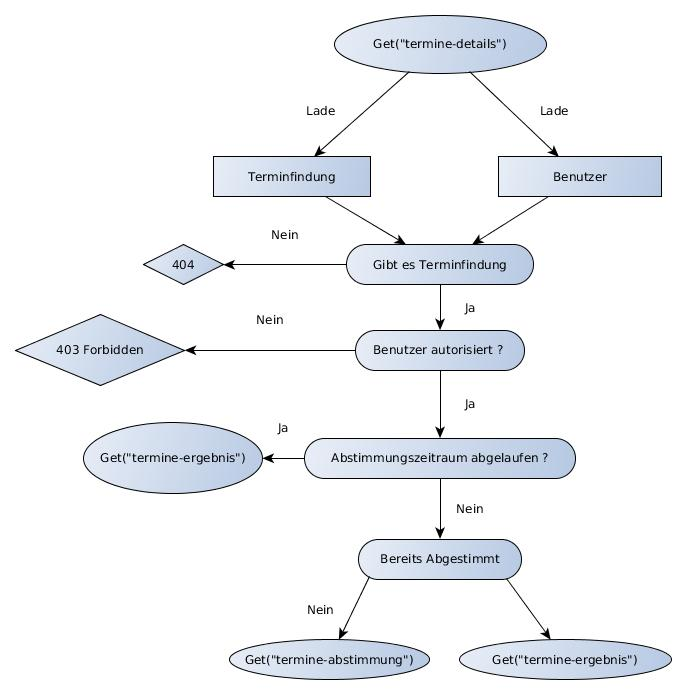
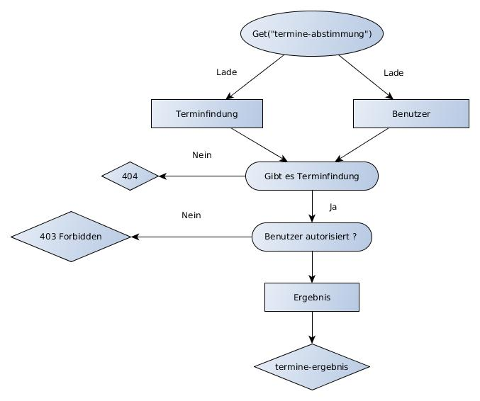
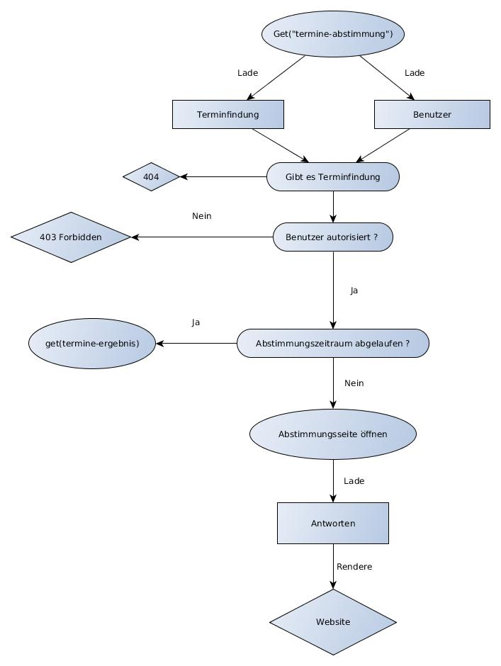
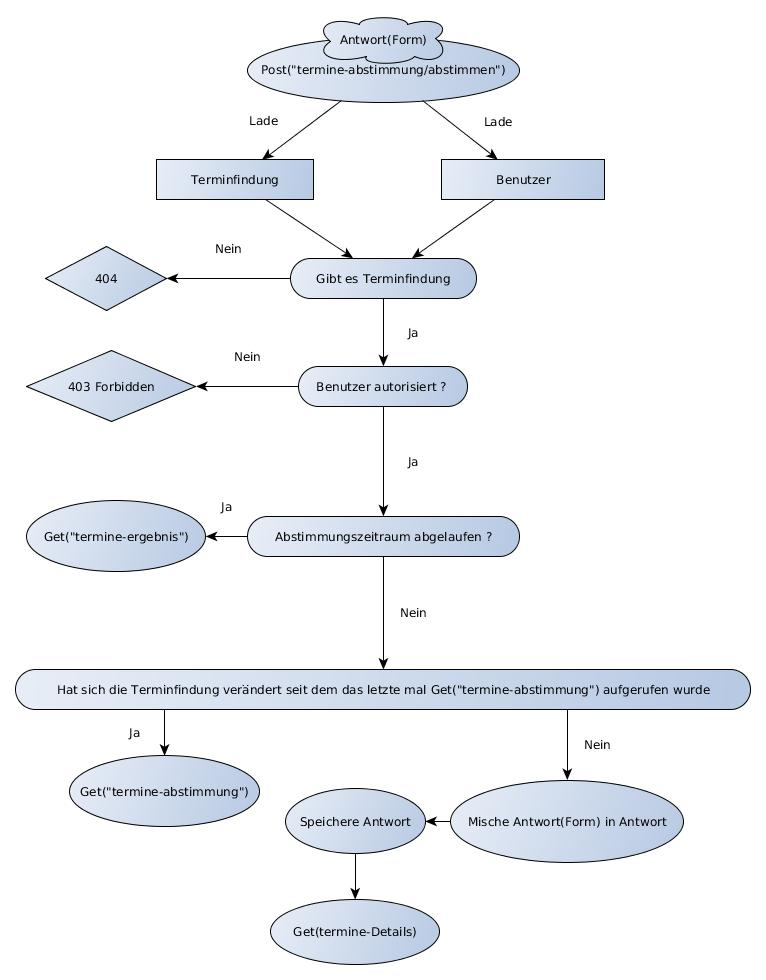

[[section-runtime-view]]
== Laufzeitsicht

[role="arc42help"]
****
.Inhalt
Diese Sicht erklärt konkrete Abläufe und Beziehungen zwischen Bausteinen in Form von Szenarien aus den folgenden Bereichen:

*  Wichtige Abläufe oder _Features_:
Wie führen die Bausteine der Architektur die wichtigsten Abläufe durch?
*  Interaktionen an kritischen externen Schnittstellen:
Wie arbeiten Bausteine mit Nutzern und Nachbarsystemen zusammen?
* Betrieb und Administration: Inbetriebnahme, Start, Stop.
* Fehler- und Ausnahmeszenarien

Anmerkung:
Das Kriterium für die Auswahl der möglichen Szenarien (d.h. Abläufe) des Systems ist deren Architekturrelevanz.
Es geht nicht darum, möglichst viele Abläufe darzustellen, sondern eine angemessene Auswahl zu dokumentieren.

.Motivation
Sie sollten verstehen, wie (Instanzen von) Bausteine(n) Ihres Systems ihre jeweiligen Aufgaben erfüllen und zur Laufzeit miteinander kommunizieren.

Nutzen Sie diese Szenarien in der Dokumentation hauptsächlich für eine verständlichere Kommunikation mit denjenigen Stakeholdern, die die statischen Modelle (z.B. Bausteinsicht, Verteilungssicht) weniger verständlich finden.

.Form
Für die Beschreibung von Szenarien gibt es zahlreiche Ausdrucksmöglichkeiten.
Nutzen Sie beispielsweise:

* Nummerierte Schrittfolgen oder Aufzählungen in Umgangssprache
* Aktivitäts- oder Flussdiagramme
* Sequenzdiagramme
* BPMN (Geschäftsprozessmodell und -notation) oder EPKs (Ereignis-Prozessketten)
* Zustandsautomaten
* ...
****

=== Terminfindung erstellen

Der Nutzer klickt auf der Übersichtsseite auf einen Button und wird zum Erstellen einer neuen Terminfindung weitergeleitet. Dort kann der Nutzer wichtige Informationen, wie den Titel oder den Ort eingeben. Desweiteren muss der Benutzer mindestens einen Terminvorschlag eingeben und kann optionale Einstellungen wählen. Mit einem Klick auf erstellen wird die Terminabstimmung erstellt und der Benutzer auf die Übersichtseite weitergeleitet.

=== Details bzw. Ergebnis einer Terminfindung anzeigen

=== Abstimmen

Mit einem Klick auf Abstimmen auf der Übersichtsseite wird der Benutzer zur Abstimmungsseite geleitet. Sort kann er zu jedem Vorschlag eine Stimme abgeben. Er kann zwischen "ich habe Zeit", "ich habe vielleicht Zeit" und "ich kann nicht" wählen.
Sobald er für alle Vorschläge eine Stimme abgegeben hat, kann er mit einem Klick auf Abstimmen seine Eingaben speichern und bekommt das Ergebnis der Abstimmung angezeigt.

